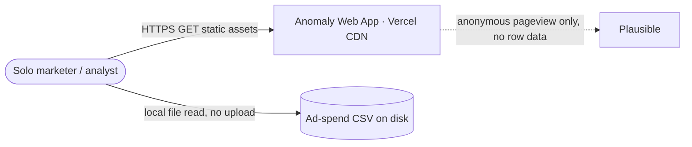
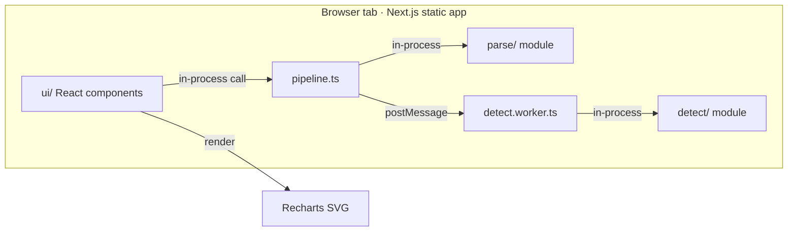
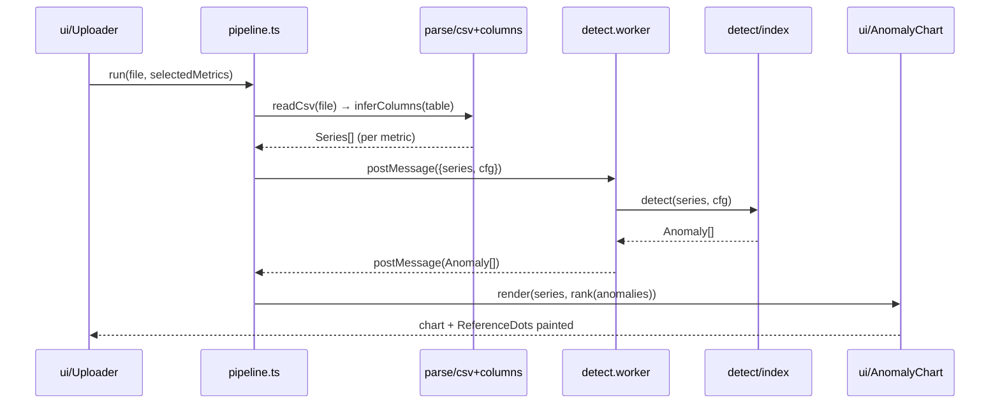

# Ad Spend Anomaly Detector — Technical Spec

## 0. TL;DR

A browser-only Next.js 15 static app that parses an ad-spend CSV entirely client-side (Papaparse), runs per-metric statistical anomaly detection (Z-score for rate metrics, MAD for heavy-tailed spend) as pure TypeScript functions, and renders a Recharts time-series with severity-tiered anomaly overlays — zero backend, zero DB, zero data egress (per prd.md §1-2). The single riskiest technical decision is doing all detection **in-browser** to honor the no-egress privacy guarantee and a $0 infra budget; revisit if real CSVs routinely exceed ~50k rows or the main thread blocks render past the 15s time-to-first-anomaly budget (prd.md §3 KR3). The MVP ships M1 (walking skeleton: parse → detect → chart) then M2 (full P0 FR surface + export), both verified by an executable command.

---

## 1. Build Constitution & Complexity Tracking

**Non-negotiables (defaults — override only with a §1.1 row + a §23 ADR):**
- Test-first for every P0 behavior (write the failing test before the implementation — see §19).
- No persistent storage — single-session, in-memory shapes only (a DB would violate the prd.md §5.4 FR-10 no-egress guarantee, not just house default).
- House stack: Next.js 15 + TypeScript on Vercel (static export).
- One-command local run; no secrets in the repo; dependencies pinned + verified on the npm registry before install.
- Any AI- or marketplace-generated code (v0 UI output) passes `/code-review` + SAST before it merges (see §18, §19).

### 1.1 Complexity Tracking (deviations from defaults)

| Deviation | Why needed | Simpler alternative rejected because | ADR |
|-----------|-----------|--------------------------------------|-----|
| Web Worker for detection on >10k-row CSVs | Keep main thread free so chart paints within the §17 / prd.md §3 KR3 15s budget | Synchronous detect() blocks render and trips the latency SLO on large files | ADR-1 |

*Anti-pattern:* silent deviation. Using a non-default stack/storage/pattern without a tracking row + ADR is how complexity creeps in unjustified.

---

## 2. Build Delta (what this build adds over the PRD)

| Need (1–3 words) | PRD ref | Build delta (the engineering move) |
|------------------|---------|------------------------------------|
| CSV ingest | prd.md §5.4 FR-1 | `src/parse/csv.ts` — Papaparse streaming reader, 10 MB guard before parse |
| Column inference | prd.md §5.4 FR-2 | `src/parse/columns.ts::inferColumns()` — header-token + first-20-row type heuristics, returns editable `ColumnMap` |
| Detection engine | prd.md §5.4 FR-3 | `src/detect/index.ts::detect()` — dispatches Z-score (`zscore.ts`) for rates, MAD (`mad.ts`) for spend; pure, Web-Worker-hostable |
| Chart overlay | prd.md §5.4 FR-4 | `src/ui/AnomalyChart.tsx` — Recharts `LineChart` + `ReferenceDot` per anomaly, color by tier |
| Severity tiering | prd.md §5.4 FR-5 | `src/detect/severity.ts::tier()` — score→{low,med,high} thresholds, config-driven |
| Ranked list | prd.md §5.4 FR-6 | `src/detect/rank.ts::rank()` — sort by `tier × spendImpact` |
| No data egress | prd.md §5.4 FR-10 | architectural — static export, no `/api` route, no fetch of row data (enforced by §19 e2e network assertion) |
| Sensitivity | prd.md §5.4 FR-7 | `src/detect/thresholds.ts` — Conservative/Balanced/Aggressive presets re-run client-side |
| Cause hints | prd.md §5.4 FR-8 | `src/detect/causes.ts::hint()` — rule-based co-occurrence lookup table |
| Export | prd.md §5.4 FR-9 | `src/export/png.ts` (chart→canvas) + `src/export/csv.ts` (ranked list) |
| Product goals | prd.md §3 | reframed as §3 engineering Non-Goals (out-of-scope fences) |
| Phasing | prd.md §6 | mapped to §25 milestones M1–M2 (Phase-2 items are §3 Non-Goals) |
| Success metrics | prd.md §7 | wired as §16 metric rows (instrumented client-side, no target restated) |

### 2.1 FR Traceability

| FR (ref prd.md §5.4) | Implementing module/file | Interface (→ §10/§11) | WBS tasks (§20) | Tests (§19) |
|----------------------|--------------------------|-----------------------|-----------------|-------------|
| FR-1 [P0] | `src/parse/csv.ts` | `readCsv(file: File): Promise<RawTable>` | T006, T007 | T006 |
| FR-2 [P0] | `src/parse/columns.ts` | `inferColumns(t: RawTable): ColumnMap` | T008, T009 | T008 |
| FR-3 [P0] | `src/detect/index.ts` | `detect(s: Series, cfg: DetectConfig): Anomaly[]` | T004, T005, T010 | T004, T005 |
| FR-4 [P0] | `src/ui/AnomalyChart.tsx` | `<AnomalyChart series anomalies />` | T015 | T017 |
| FR-5 [P0] | `src/detect/severity.ts` | `tier(score: number, cfg): Severity` | T011 | T010 |
| FR-6 [P0] | `src/detect/rank.ts` | `rank(a: Anomaly[]): Anomaly[]` | T012 | T011 |
| FR-7 [P1] | `src/detect/thresholds.ts` | `presetFor(level: Sensitivity): Thresholds` | T018 | T015 |
| FR-8 [P1] | `src/detect/causes.ts` | `hint(a: Anomaly, ctx: Series[]): string` | T017 | T016 |
| FR-9 [P1] | `src/export/{png,csv}.ts` | `exportPng(el)` / `exportCsv(a: Anomaly[])` | T019 | T018 |
| FR-10 [P0] | architectural (no `/api`) | N/A — no HTTP surface | T014, T020 | T019 (e2e network assertion) |

*Anti-pattern:* reproducing an FR's behavior sentence. The PRD already says WHAT; this table says WHERE the build implements it and links the proof. Every P0 FR traces to a module **and** a task **and** a test.

---

## 3. Goals & Non-Goals (engineering deltas only)

> Intent: prd.md §3 (product goals — not restated here).

**Engineering Non-Goals (build exclusions)**
- NG1: No backend / no `/api` route in MVP — reason: prd.md §5.4 FR-10 no-egress is satisfied by a pure static export; a server would expand the threat surface for no MVP value.
- NG2: No persistent storage or session history — reason: prd.md §6 lists this permanent-out-of-scope; the tool is single-session by design.
- NG3: No LLM call surface in MVP — reason: prd.md §5.4 FR-12 is P2 and gated; §18.A therefore renders N/A.
- NG4: No direct Google Ads / Meta OAuth ingestion — reason: prd.md §6 Phase-2; CSV is the MVP wedge.
- NG5: No ML / Prophet / STL forecasting — reason: ADR-3 selects Z-score+MAD; ML is a §23 revisit-when, not a build.
- NG6: No multi-metric correlation view in M1/M2 critical path — reason: prd.md FR-11 is P1; built only if M2 capacity allows, otherwise deferred.

*Anti-pattern:* re-listing the PRD's product goals. Goals live in the PRD; this section's value is the explicit *out-of-scope* fence.

---

## 4. Assumptions & Constraints (build ledger)

**Assumptions**

| # | Assumption (build belief) | Source | Risk if wrong | How we'll validate |
|---|---------------------------|--------|---------------|--------------------|
| A1 | Z-score + MAD is accurate enough vs. ML for typical marketer CSVs | prd.md §5.6 | KR2 precision/recall miss; tool feels brittle | synthetic-benchmark suite gates CI (test T021) |
| A2 | In-browser detection stays under the 15s budget for ≤50k rows | inferred | latency SLO breach on large files | perf assertion in T020; Worker fallback (ADR-1) |
| A3 | Header-token + 20-row heuristics hit ≥90% column-map accuracy | prd.md §5.6 | users fight a mapping UI, bounce | 10-fixture accuracy test (T008) |
| A4 | Recharts can render ≥365 points + N `ReferenceDot`s at 60fps | inferred | chart jank on year-long CSVs | manual M2 check + decimate if >2k points |

**Constraints**

| Type | Constraint | Source |
|------|-----------|--------|
| Time | MVP in ~2 working days of build (≈16h); P1 polish a follow-up | idea.md `estimated_time: 960` |
| Budget | Infra $0/mo — static Vercel hobby tier; no paid services in MVP | prd.md §5.5 / lean-canvas inferred |
| Skill | Solo builder strong in React/TS + analytics; avoid stacks needing native/ML ops | author context |
| Data/Regulatory | Client ad data is sensitive but never leaves the browser → no GDPR processing role; privacy page legal-reviewed | prd.md §5.4 FR-10, §5.5 |

*Anti-pattern:* aspirational constraints ("must scale to 1M users") the MVP will never exercise.

---

## 5. Tech Stack & Package Manifest

**Runtime / toolchain:** Node 20.x · pnpm 9.x · TypeScript 5.6 · static export (`output: 'export'`)

**Dependencies (pinned major, minor floating — verify each on the npm registry before install):**

```jsonc
// package.json excerpt
{
  "dependencies": {
    "next": "15.x",          // app shell + static export — vs Vite SPA (no file-based routing/export), vs Remix (server-leaning, smaller ecosystem)
    "react": "19.x",         // pinned to Next 15's bundled major
    "react-dom": "19.x",
    "recharts": "^2.13",     // charts — vs visx (more boilerplate per chart, ADR-2), vs Chart.js (canvas, weaker React composition)
    "papaparse": "^5.4"      // CSV — vs csv-parse (Node-only streams), vs hand-rolled (quoting/encoding edge cases)
  },
  "devDependencies": {
    "typescript": "^5.6",
    "vitest": "^2.1",            // unit/integration — Vite-native, fast watch for the §19 TDD loop
    "@playwright/test": "^1.48", // e2e + network-egress assertion (FR-10)
    "@types/papaparse": "^5.3"
  }
}
```

No backend dependency, no DB driver, no ORM — by design (§3 NG1, ADR-1). Any deviation from this manifest needs a §23 MADR ADR.

*Anti-pattern:* naming a stack in prose with no pinned, registry-verifiable manifest entry. "We'll use Next and some chart lib" is not a build contract.

---

## 6. Module / File Tree

```
src/
  parse/csv.ts            # FR-1 — Papaparse streaming reader + 10MB guard → RawTable
  parse/columns.ts        # FR-2 — inferColumns(): header + content heuristics → ColumnMap
  detect/index.ts         # FR-3 — detect() dispatch (zscore | mad) → Anomaly[]
  detect/zscore.ts        # FR-3 — Z-score for rate metrics (CTR, CVR)
  detect/mad.ts           # FR-3 — MAD for heavy-tailed spend
  detect/severity.ts      # FR-5 — tier(score): low | med | high
  detect/rank.ts          # FR-6 — rank() by tier × spendImpact
  detect/thresholds.ts    # FR-7 — sensitivity presets
  detect/causes.ts        # FR-8 — rule-based co-occurrence hints
  export/png.ts           # FR-9 — chart element → 2× PNG
  export/csv.ts           # FR-9 — ranked anomalies → CSV blob
  pipeline.ts             # orchestrates readCsv → inferColumns → detect → rank
  worker/detect.worker.ts # ADR-1 — hosts detect() off main thread for >10k rows
  types.ts                # RawTable, Series, ColumnMap, Anomaly, Severity, DetectConfig
  ui/AnomalyChart.tsx     # FR-4 — Recharts LineChart + ReferenceDot overlays
  ui/AnomalyList.tsx      # FR-6 — ranked list, click → focus chart range
  ui/Uploader.tsx         # FR-1,2 — drag-drop + column-map confirm
app/page.tsx              # composition root — wires Uploader → pipeline → Chart/List
tests/parse/              # mirrors src/parse, test-first
tests/detect/             # mirrors src/detect, test-first
e2e/upload.spec.ts        # Playwright happy path + FR-10 network assertion
fixtures/                 # 10 column-map fixtures + 30-series synthetic benchmark
```

*Anti-pattern:* a vague tree (`src/`, `tests/`) with no real file names. Tasks in §20 reference these paths — they must exist here.

---

## 7. System Architecture (C4)

**C4 L1 — System Context**


**C4 L2 — Containers**


**Node responsibilities**

| Node | Responsibility | Location |
|------|---------------|----------|
| Anomaly Web App | serves static UI; all compute client-side | `app/`, `src/ui/` |
| pipeline.ts | orchestrates parse → detect → rank | `src/pipeline.ts` |
| parse/ | read CSV, infer columns | `src/parse/` |
| detect.worker.ts | hosts detection off main thread (>10k rows) | `src/worker/` |
| detect/ | Z-score / MAD math + severity + rank, pure | `src/detect/` |
| Plausible | anonymous usage metrics only — never row data | external |

*Anti-pattern:* one flat blob mixing users, services, and functions. C4 separates zoom levels; edges without protocols hide the real contracts.

---

## 8. Runtime View

Component message flow for the core path (user-visible flow per prd.md §5.2 — not restated):



*Anti-pattern:* re-narrating prd.md §5.2 ("user clicks the blue button"). This is component-to-component message flow, not the user journey.

---

## 9. Data Model

N/A — no persistent state (§3 NG2; prd.md §6 single-session). All shapes are transient and defined as TypeScript types in `src/types.ts` (consumed in §10). The load-bearing in-memory shapes:

### 9.1 Transient: `Series`

| Field | Type | Constraints | Notes |
|-------|------|------------|-------|
| metric | `MetricName` | one of Spend/CTR/CVR/CPI/… | drives detector choice |
| points | `{ date: ISODate; value: number }[]` | ≥14 entries to run (baseline) | sorted ascending |

### 9.2 Transient: `Anomaly`

| Field | Type | Constraints | Notes |
|-------|------|------------|-------|
| date | ISODate | within series range | |
| metric | MetricName | | |
| value | number | | observed |
| expected | `[number, number]` | | tolerance band |
| score | number | ≥0 | z or MAD score |
| severity | `'low'\|'med'\|'high'` | FR-5 | |
| spendImpact | number | ≥0 | weight for FR-6 rank |

### 9.3 Lifecycle
N/A — values are computed per upload and garbage-collected on next upload; no state transitions persist.

*Anti-pattern:* listing every imaginable column. Include only fields MVP reads or writes.

---

## 10. Components & Interfaces

| Component | Public interface (signature) | Consumers |
|-----------|------------------------------|-----------|
| `parse/csv.ts` | `readCsv(file: File): Promise<RawTable>` | `pipeline.ts` |
| `parse/columns.ts` | `inferColumns(t: RawTable): ColumnMap` | `pipeline.ts`, `ui/Uploader` |
| `detect/index.ts` | `detect(s: Series, cfg: DetectConfig): Anomaly[]` | `pipeline.ts`, `worker`, tests |
| `detect/zscore.ts` | `zscore(values: number[]): number[]` | `detect/index.ts` |
| `detect/mad.ts` | `mad(values: number[]): number[]` | `detect/index.ts` |
| `detect/severity.ts` | `tier(score: number, cfg: DetectConfig): Severity` | `detect/index.ts` |
| `detect/rank.ts` | `rank(a: Anomaly[]): Anomaly[]` | `pipeline.ts`, `ui/AnomalyList` |
| `detect/thresholds.ts` | `presetFor(level: Sensitivity): Thresholds` | `pipeline.ts`, `ui` |
| `detect/causes.ts` | `hint(a: Anomaly, ctx: Series[]): string` | `ui/AnomalyList` |
| `export/png.ts` | `exportPng(el: HTMLElement): Promise<Blob>` | `ui/AnomalyChart` |
| `export/csv.ts` | `exportCsv(a: Anomaly[]): Blob` | `ui/AnomalyList` |
| `pipeline.ts` | `run(file: File, cfg: DetectConfig): Promise<{series: Series[]; anomalies: Anomaly[]}>` | `app/page.tsx` |
| `ui/AnomalyChart.tsx` | `<AnomalyChart series={Series} anomalies={Anomaly[]} />` | `app/page.tsx` |

*Anti-pattern:* describing a component's job in prose without its signature. The signature is what the next task implements against.

---

## 11. API / Interface Contracts

N/A — no HTTP surface (§3 NG1, ADR-1). The build is a static export with no `/api` route; all external-facing contracts are the in-process module signatures in §10. The one cross-context boundary is the Web Worker message protocol:

### 11.1 Worker message contract (`worker/detect.worker.ts`)

Request (main → worker):
```ts
postMessage({ kind: 'detect', series: Series[], cfg: DetectConfig })
```
Response (worker → main):
```ts
postMessage({ kind: 'result', anomalies: Anomaly[] })
// or
postMessage({ kind: 'error', reason: 'NO_NUMERIC_COLUMN' | 'INSUFFICIENT_DATA' })
```
Failure modes: `error` with `reason` (surfaced per §12); worker crash → main-thread fallback to synchronous `detect()`.

*Anti-pattern:* describing endpoints in prose instead of payloads. Payload shapes ARE the contract.

---

## 12. Error Handling & Recovery

| EARS scenario | User-facing message | Retry / recovery | Log location |
|---------------|---------------------|------------------|--------------|
| IF the uploaded file is not valid CSV THEN the system shall reject it before parsing | "That doesn't look like a CSV — check the file format." | inline, no retry | `console.warn` |
| IF the CSV has no numeric column THEN the system shall halt detection and prompt | "No numeric data found — we need at least one spend/metric column." | inline; offer manual column map | `console.warn` |
| IF the file exceeds 10 MB THEN the system shall reject before reading (FR-1) | "File is over 10 MB — trim to daily granularity and retry." | inline, no retry | `console.warn` |
| IF a metric series has < 14 points THEN the system shall block detection for that metric | "Need ≥ 14 days of data for a stable baseline." | per-metric skip, others proceed | `console.info` |
| IF the detect worker throws or times out THEN the system shall fall back to synchronous detection | (silent unless fallback also fails) | main-thread `detect()` | `console.error` |
| IF PNG export fails (canvas tainted/unsupported) THEN the system shall offer CSV export instead | "Couldn't render the image — exporting the CSV instead." | auto-fallback to `exportCsv` | `console.error` |

*Anti-pattern:* a happy-path-only spec. Unhandled sad paths are where AI builders silently skip work.

---

## 13. External Integrations

| Service | Purpose | Auth | Rate limits | Failure handling | MVP? |
|---------|---------|------|-------------|------------------|------|
| Plausible Analytics | anonymous pageviews + custom events (prd.md §7 leading indicators) | none (script tag, domain-scoped) | n/a (fire-and-forget) | non-blocking; drop on failure, never block UI | yes |
| Vercel (static hosting/CDN) | serve the static export | deploy token (CI only) | hobby-tier build limits | redeploy on failure | yes |

No data-bearing integrations — CSV row content never reaches any service (FR-10). The optional Phase-2 LLM hint endpoint is a §3 Non-Goal, not wired.

*Anti-pattern:* integrations without rate limits. Rate limits shape architecture (cron intervals, fan-out).

---

## 14. Deployment & Environments

**Deployment target:** Vercel static export (`next build` with `output: 'export'`, no serverless functions) — chosen because the app is pure client-side and $0 infra is a §4 constraint.

| Environment | URL / host | Data store | Notes |
|-------------|-----------|-----------|-------|
| Local dev | `localhost:3000` | none (in-memory) | `pnpm dev` |
| Production | `anomalycheck.io` (or `/tools/...` under dbenger.com — prd.md §9 open) `> _INFERRED_` | none | static CDN; auto-deploy on `main` |

Staging: not used — solo operator, ship to all behind a single deploy.

**Run locally in one command:** `pnpm dev`.

*Anti-pattern:* environments the solo operator will never stand up. Say "Staging: not used" if true.

---

## 15. Configuration & Secrets

No runtime secrets — the app has no API keys (no backend, no LLM in MVP). The only sensitive token is CI-scoped:

| Var | Purpose | Example | Source | Required? |
|-----|---------|---------|--------|-----------|
| `VERCEL_TOKEN` | CI deploy of static export | `vrcl_…` | Vercel project settings (CI env, not repo) | CI only |
| `NEXT_PUBLIC_PLAUSIBLE_DOMAIN` | analytics domain scope | `anomalycheck.io` | build env | yes |

No PII/payment/health data is stored anywhere (FR-10). If the Phase-2 LLM hint ships, its provider key cross-links back here.

*Anti-pattern:* committing secrets to the spec. Sample values only.

---

## 16. Observability

**Logs:** browser `console` (warn/error/info per §12); no server logs (no server). Plausible captures events, not logs.

**Metrics:** (each references a prd.md §7 success metric — target not restated)

| Metric | Where emitted | Dashboard |
|--------|--------------|-----------|
| `upload_started` / `upload_succeeded` (prd.md §7a unique-uploader) | `ui/Uploader` | Plausible |
| `time_to_first_anomaly_ms` (prd.md §7a TTFA / §3 KR3) | `pipeline.ts` after chart paint | Plausible custom event |
| `export_clicked` (prd.md §7a export/share / §3 KR4) | `export/*` | Plausible |
| `hint_expanded` (prd.md §7a hint click-through) | `ui/AnomalyList` | Plausible |
| `benchmark_precision` / `benchmark_recall` (prd.md §7b / §3 KR2) | CI test run | CI summary, not runtime |

**Traces:** N/A — single-process client app; console + Plausible sufficient.

**Operator alerts:**

| Alert | Trigger | Channel | Severity |
|-------|--------|---------|----------|
| CI benchmark regression | precision/recall below gate in CI | GitHub Actions email | High |
| Deploy failure | Vercel build fails | Vercel notification | Med |

*Anti-pattern:* observability for a service that doesn't exist yet. Right-size to actual deployment.

---

## 17. Performance & Scale

**Expected MVP load:** 1 user per browser session; CSVs typically 30–365 rows, supported up to ~50k rows / ≤10 MB (FR-1).
**SLOs:** time-to-first-anomaly ≤ 15s p95 (prd.md §3 KR3); metric switch re-render ≤ 200ms (prd.md US-002); sensitivity re-run ≤ 1s (prd.md US-004). No uptime SLO beyond Vercel CDN.

| Potential bottleneck | Mitigation |
|---------------------|------------|
| Synchronous `detect()` blocks main thread on large CSVs | Web Worker off-thread detection (ADR-1) above 10k rows |
| Recharts re-render on every metric switch | memoize series; decimate to ≤2k plotted points |
| Parsing a 10 MB CSV all at once | Papaparse streaming/chunked parse |

*Anti-pattern:* designing for 1M-user scale on an MVP with 3 users.

---

## 18. Security & Privacy

**Authentication:** none — loginless, single-session tool (prd.md §1).
**Authorization:** none — no accounts, no multi-tenant data.
**Data handling:** PII stored: none persisted · Retention: zero (in-memory, discarded on reload) · Encryption: in-transit TLS for static assets only; no row data ever transmitted (FR-10).
**Threat model (top 3):** `> _INFERRED_` (no pre-mortem.md present)
1. Accidental data egress via a future fetch/telemetry call — mitigation: Playwright e2e asserts zero network requests carry row bytes (T019); CSP restricts `connect-src`.
2. Supply-chain / slopsquatted dependency or vulnerable v0-generated UI code — mitigation: pin + registry-verify deps (§5); `/code-review` + semgrep on every v0-generated file before merge.
3. Malicious CSV (formula injection on CSV export) — mitigation: prefix `=,+,-,@`-leading cells on export (`export/csv.ts`).
**AI-generated-code control:** Every v0- or marketplace-generated UI file → `/code-review` + SAST (semgrep) + verify every imported package exists on the npm registry before merge (AI code is ~45% vulnerable and hallucinates ~20% of imports).
**Compliance:** none — no personal data is processed server-side; the app is a client-side calculator, so no controller/processor obligations arise (privacy page states this, legal-reviewed per §4).

### 18.A AI Behavior Contract

N/A — no model-call surface in MVP. The MVP "possible cause" hints are rule-based (`detect/causes.ts`, FR-8); the LLM narrative (prd.md §5.4 FR-12) is P2 and a §3 Non-Goal, so there is no model call to govern in this build. Populate this section if/when FR-12 enters scope.

---

## 19. Testing Strategy & Test List (test-first)

**Cadence:** write the failing test → confirm RED → minimal code to GREEN → REFACTOR. One behavior at a time.

**Test List (P0 first):**

| test-id | SPEC:FR | file | given / when / then | drives impl |
|---------|---------|------|---------------------|-------------|
| T004 | FR-3 | `tests/detect/zscore.test.ts` | given a rate series with one outlier · when detect(zscore) · then exactly 1 Anomaly, score>3 | `src/detect/zscore.ts` |
| T005 | FR-3 | `tests/detect/mad.test.ts` | given a heavy-tailed spend series with a spike · when detect(mad) · then spike flagged, normal noise not | `src/detect/mad.ts` |
| T006 | FR-1 | `tests/parse/csv.test.ts` | given a 30-row headered CSV · when readCsv() · then RawTable with 30 rows, headers preserved | `src/parse/csv.ts` |
| T008 | FR-2 | `tests/parse/columns.test.ts` | given headers `Day,Cost,Clicks,Conv.` · when inferColumns() · then Date/Spend/Clicks/Conversions mapped (10-fixture ≥90%) | `src/parse/columns.ts` |
| T010 | FR-5 | `tests/detect/severity.test.ts` | given scores 1.8/2.7/4.0 · when tier() · then low/med/high | `src/detect/severity.ts` |
| T011 | FR-6 | `tests/detect/rank.test.ts` | given anomalies of mixed tier+spend · when rank() · then sorted by tier×spendImpact desc | `src/detect/rank.ts` |
| T015 | FR-7 | `tests/detect/thresholds.test.ts` | given Conservative preset · when applied to seasonal data · then ≤3% points flagged | `src/detect/thresholds.ts` |
| T016 | FR-8 | `tests/detect/causes.test.ts` | given spend-spike + CTR-drop within 1 day · when hint() · then returns audience/bid-change hint | `src/detect/causes.ts` |
| T017 | FR-4 | `tests/ui/chart.test.tsx` | given series+anomalies · when render · then a ReferenceDot per anomaly, colored by tier | `src/ui/AnomalyChart.tsx` |
| T019 | FR-10 | `e2e/upload.spec.ts` | given any CSV upload · when detection runs · then zero network requests contain row bytes | architectural (no `/api`) |

**Lanes (secondary):**

| Lane | Scope | Tooling | Frequency |
|------|-------|---------|-----------|
| Unit | detector math, severity, rank, parse | vitest | watch + pre-commit |
| Integration | `pipeline.ts` parse→detect→rank | vitest | CI on PR |
| Benchmark | 30 synthetic + 10 real-CSV precision/recall gate (prd.md §3 KR2) | vitest | CI on PR |
| E2E | upload→chart flow + FR-10 network assertion | Playwright | before release |
| Generated-code review | every v0-generated UI file | `/code-review` + semgrep | before merge |

**Explicitly not tested:** cross-browser matrix — Chrome/Chromium only for MVP; mobile layout (desktop-first).

*Anti-pattern:* a Testing section that names lanes but enumerates zero tests, or any P0 FR lacking a pre-named failing test. "Tests later" = no tests.

---

## 20. Work Breakdown Structure (tasks.md)

### Phase 0 — Setup
- [ ] T001 Scaffold Next.js 15 static-export app to the §6 file tree; init pnpm + pin deps from §5 _(infra)_
- [ ] T002 [P] Configure vitest + Playwright + CI lanes (unit, integration, benchmark, e2e) _(infra)_

### Phase 1 — Foundational (blocking)
- [ ] T003 Define `RawTable, Series, ColumnMap, Anomaly, Severity, DetectConfig` in `src/types.ts` _(FR-1,2,3,5,6)_
- [ ] T004 [P] Write failing test `tests/detect/zscore.test.ts` — one-outlier rate series → 1 Anomaly score>3 _(FR-3 · write FIRST · confirm RED)_
- [ ] T005 [P] Write failing test `tests/detect/mad.test.ts` — spend spike flagged, noise ignored _(FR-3 · write FIRST · confirm RED)_

### Phase 2 — M1 Walking Skeleton
- [ ] T006 [P] Write failing test `tests/parse/csv.test.ts` — headered CSV → RawTable _(FR-1 · write FIRST · confirm RED)_
- [ ] T007 Implement `src/parse/csv.ts` (Papaparse, 10 MB guard) to GREEN T006 _(FR-1, test T006)_
- [ ] T008 [P] Write failing test `tests/parse/columns.test.ts` — header heuristics map (10 fixtures ≥90%) _(FR-2 · write FIRST · confirm RED)_
- [ ] T009 Implement `src/parse/columns.ts::inferColumns()` to GREEN T008 _(FR-2, test T008)_
- [ ] T010 Implement `src/detect/zscore.ts` + `src/detect/mad.ts` to GREEN T004, T005 _(FR-3, tests T004/T005)_
- [ ] T011 Implement `src/detect/severity.ts::tier()` + write/GREEN `tests/detect/severity.test.ts` _(FR-5, test T010)_
- [ ] T012 Implement `src/detect/rank.ts::rank()` + write/GREEN `tests/detect/rank.test.ts` _(FR-6, test T011)_
- [ ] T013 Implement `src/detect/index.ts::detect()` dispatch + wire `src/pipeline.ts` (readCsv→inferColumns→detect→rank); depends on T007,T009,T010,T011,T012 _(FR-3)_
- **Checkpoint M1:** `pnpm test parse/ detect/ && pnpm build` green; seed CSV → ranked anomalies in console.

### Phase 3 — M2 MVP
- [ ] T014 Build `src/worker/detect.worker.ts` + main-thread fallback (ADR-1); route >10k-row series through it _(FR-3, perf §17)_
- [ ] T015 [P] Render `src/ui/AnomalyChart.tsx` (Recharts LineChart + ReferenceDot); design from §22 _(FR-4 · test T017)_
- [ ] T016 [P] Build `src/ui/Uploader.tsx` (drag-drop + column-map confirm) _(FR-1,2)_
- [ ] T017 Build `src/ui/AnomalyList.tsx` (ranked list, row→chart focus) + `src/detect/causes.ts::hint()` _(FR-6,8 · test T016)_
- [ ] T018 Wire sensitivity preset `src/detect/thresholds.ts` into UI re-run _(FR-7 · test T015)_
- [ ] T019 Implement `src/export/png.ts` + `src/export/csv.ts`; compose all in `app/page.tsx` _(FR-9)_
- [ ] T020 [P] Write `e2e/upload.spec.ts` (happy path + FR-10 zero-egress network assertion) _(FR-10 · write FIRST for the egress assertion · confirm RED)_
- [ ] T021 [P] Build the 30-series synthetic benchmark fixture + precision/recall CI gate _(FR-3 quality · prd.md §3 KR2)_
- **Checkpoint M2:** `pnpm test && pnpm exec playwright test e2e/upload.spec.ts` green; benchmark precision ≥ gate; visual diff vs §22 reference ≤2%.

### Phase 4 — Polish
- [ ] T022 [P] Multi-metric correlation view `src/ui/CorrelationView.tsx` (deferred unless M2 capacity) _(FR-11)_

### Dependency graph
```
T001→T002→T003→{T004,T005,T006→T007,T008→T009}→T010→T011→T012→T013
T013→T014→{T015,T016,T017}→T018→T019→{T020,T021}→T022
```

*Anti-pattern:* tasks without file paths, or implementation tasks ordered before their tests, or a flat list that ignores dependencies.

---

## 21. Build Toolkit (AI agents · skills · MCPs)

**(a) Build agent + per-milestone executor**

| Milestone | Executor | Why |
|-----------|----------|-----|
| default | Claude Code | house default — native MCP + the §20/§19 test-first loop is authored for it |
| M2 UI (T015–T017) | v0 generation → Claude Code wires + reviews it | faster shadcn/Recharts component scaffold; output dropped into §6 tree |

**(b) In-repo skills to invoke** (capability detected from §7 → existing skill first)

| Need | In-repo skill | Invoke when |
|------|---------------|-------------|
| UI build/review | `/ui-ux-pro-max` | building any screen (Uploader, Chart, List) — T015–T017 |
| Diagrams | `/excalidraw` | rendering §7 C4 / §8 runtime as editable artifacts |
| Deploy (Next static) | `/vercel:deploy` | shipping the M2 Checkpoint |
| Code QA | `/code-review` | every v0-generated file + each milestone checkpoint |

**(c) MCP servers**

| MCP server | Status | Tools used | Auth (→ §15) |
|------------|--------|-----------|--------------|
| manager-ai | wired | `manager-ai: get_project_artifacts`, `manager-ai: list_projects` | local |

**Marketplace gaps:** N/A — house skills suffice. No FR implies a capability (scraping, payments, auth, real-time, etc.) that an in-repo skill doesn't already cover, so no `npx skills find` lookup is warranted.

*Anti-pattern:* a generic toolchain dump. Any row not traceable to a named §7 component / §20 task / FR — or copyable verbatim into another project — is boilerplate.

---

## 22. Design & UI-UX Tooling & Workflow

| Stage | In-repo skill (primary) | External tool (when needed) | Deliverable → §20 task |
|-------|-------------------------|------------------------------|------------------------|
| 1. Ideate | `/ui-ux-pro-max` (pick minimal data-dashboard style + palette + shadcn UP FRONT) · `/excalidraw` for layout sketch | — | wireframe (uploader + chart + list) → T015, T016, T017 |
| 2. Generate hi-fi | — | v0.dev (Next + shadcn on Vercel) | React/Tailwind/shadcn components → T015, T016, T017 |
| 3. Tokens | — | Figma Dev Mode MCP (mcp.figma.com/mcp) | `tailwind.config` severity-tier color tokens (low/med/high) → T015 |
| 4. Components | `/ui-ux-pro-max` (shadcn MCP) | `npx shadcn@latest mcp init --client claude` | installed shadcn primitives (card, slider, table) in §6 tree → T016, T018 |
| 5. Verify | `/code-review` + Playwright | Playwright screenshot-vs-reference | visual diff ≤2% → Checkpoint M2 |

**Generator selection:** Next.js + shadcn on Vercel → **v0.dev** (emits React + Tailwind + shadcn, drops directly into the §6 tree). Any v0 output is gated by the §19 Generated-code review lane and the §18 SAST + package-existence control.

*Anti-pattern:* a stage row not traceable to a §6 file / §20 task, or naming a generator without the §19 review lane + §18 control. AI-generated UI code is not exempt from review.

---

## 23. Architecture Decisions (MADR)

### ADR-1: In-browser detection (no backend API)
- **Status:** accepted
- **Context / drivers:** prd.md §5.4 FR-10 no-egress guarantee; $0 infra budget (§4); single-operator MVP.
- **Considered options:** in-browser pure TS · Next.js API route + server compute · serverless edge function.
- **Decision:** in-browser detection (Web Worker for large CSVs per §1.1).
- **Consequences:** good — zero egress is structurally guaranteed, $0 infra, no auth surface; bad — bounded by client CPU/memory, large CSVs need a Worker.
- **Confirmation:** e2e test T019/T020 asserts zero row-bearing network requests / **Revisit when:** real CSVs routinely exceed ~50k rows or detection breaches the §17 15s budget.

### ADR-2: Recharts over visx
- **Status:** accepted
- **Context / drivers:** need a time-series line chart + per-point overlay markers fast; solo builder; idea.md already names Recharts.
- **Considered options:** Recharts · visx · Chart.js · Observable Plot.
- **Decision:** Recharts.
- **Consequences:** good — declarative `LineChart`+`ReferenceDot` matches FR-4 with little code; bad — less low-level control than visx for bespoke overlays.
- **Confirmation:** T017 renders a ReferenceDot per anomaly within the §17 200ms switch budget / **Revisit when:** overlay needs exceed Recharts primitives (e.g., dense brush/zoom).

### ADR-3: Z-score + MAD over an ML model
- **Status:** accepted
- **Context / drivers:** prd.md §5.6 A1 (statistical "good enough"); prd.md §3 KR2 precision/recall gate; runs client-side, explainable.
- **Considered options:** Z-score+MAD · Isolation Forest / autoencoder (ML) · Prophet/STL seasonal decomposition.
- **Decision:** Z-score (rate metrics) + MAD (heavy-tailed spend); seasonality subtraction deferred (prd.md FR-13 P2).
- **Consequences:** good — no model weights, fully in-browser, explainable scores feed the §12 hints; bad — weaker on strongly seasonal series until FR-13.
- **Confirmation:** benchmark lane (T021 / prd.md §3 KR2) must hit precision ≥0.75, recall ≥0.80 in CI / **Revisit when:** benchmark misses on real CSVs → escalate to STL (prd.md kill/Phase-2 gate).

*Anti-pattern:* rejected alternatives that were never real candidates ("considered COBOL"). List only what a reasonable engineer would weigh.

---

## 24. Rollout & Migration

**Release plan:** ship to all behind a single static deploy; soft-launch link to PPCChat Slack + 5-user private beta (prd.md §8) — no feature flags (single cohort).
**Data migrations:** none — no persistent store (§9 N/A).
**Rollback:** `git revert <sha> && pnpm exec vercel --prod` (re-deploys the prior static build). **Trigger:** benchmark regression in CI, or post-deploy JS error rate >2% in Plausible.

*Anti-pattern:* feature flags for a 3-user beta. Flags cost complexity; use only with multiple cohorts.

---

## 25. Milestones & Phasing

Maps to prd.md §6 (referenced, not restated).

### M1 — Walking skeleton (~day 1)
**Exit criteria:** CSV → column-mapped → Z-score/MAD detected → ranked anomalies, on the happy path with seed data (no UI chrome yet).
**Tasks:** T001–T013.
**Acceptance & Verification:** `pnpm test parse/ detect/ && pnpm build` → all green; manual: seed CSV prints a ranked anomaly list to console.

### M2 — MVP (~day 2 + polish)
**Exit criteria:** all 7 P0 FRs pass (prd.md §6 MVP exit — referenced); chart + ranked list + sensitivity + export wired; FR-10 zero-egress proven; benchmark gate met.
**Tasks:** T014–T021.
**Acceptance & Verification:** `pnpm test && pnpm exec playwright test e2e/upload.spec.ts` → green (incl. T019 network assertion + T021 KR2 benchmark); visual diff vs §22 v0 reference ≤2%.

*Anti-pattern:* a milestone without an executable Acceptance command. "Looks done" is not a pass signal.

---

## 26. Open Questions (build blockers)

- [Owner: self] [blocks M2: no] Production domain — `anomalycheck.io` vs `/tools/...` under dbenger.com (the one surviving `> _INFERRED_` in §14); resolve before launch week, does not block build.
- [Owner: data] [blocks M1: yes] Default sensitivity thresholds (Conservative z>3.0 / Balanced z>2.5 / Aggressive z>2.0) — feeds `detect/thresholds.ts` (T018) and the benchmark gate; carried from prd.md §9.
- [Owner: eng] [blocks M1: yes] MAD vs Z vs STL for heavy-tailed spend — the ADR-3 confirmation benchmark must run before M1 close; carried from prd.md §9.
- Carried from prd.md §9: sensitivity-slider usage + LLM-cause-cost questions (product-open, not build-sequencing) remain in the PRD.

*Anti-pattern:* open questions without owners, or copying the PRD's product questions wholesale.

---

## 27. Changelog

- 2026-06-04 — initial draft, sourced from `idea.md` + `prd.md`.

---

## 28. Appendix: References

**Project artifacts**
- `projects/ad-spend-anomaly-detector/prd.md` — product requirements (the WHAT/WHY contract this spec references)
- `projects/ad-spend-anomaly-detector/idea.md` — original scope (React + Recharts, Z/IQR detection)
- `knowledge/research/projects/ad-spend-anomaly-detector.md` — validation/research brief (per idea.md resource_refs)

**External docs**
- Next.js static export · Recharts (`LineChart`, `ReferenceDot`) · Papaparse streaming · Playwright network interception · Plausible custom events.

**Prior art**
- Anodot, Outlier, Datadog (enterprise anomaly detection — prd.md §8); Google Ads automated rules (threshold-only baseline being beaten).

**Goal alignment**
- GOALS.md › Ship 10 products › product-in-portfolio; secondary: GOALS.md › Build custom analytical solutions.

**Diagrams**
- `projects/ad-spend-anomaly-detector/diagrams/*.excalidraw` — C4 (§7) + runtime (§8), if rendered via `/excalidraw`.
