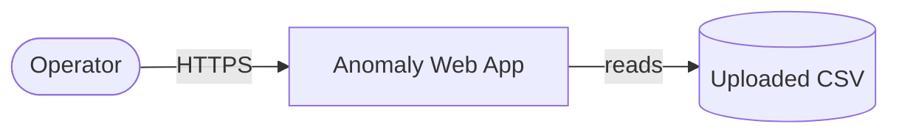
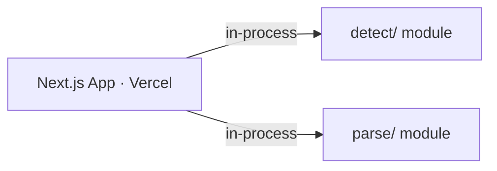
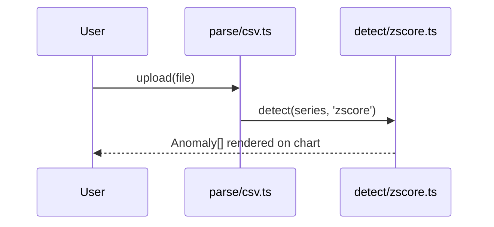

# Spec Template

Always use this exact template structure. Fill every section. When an upstream artifact is missing, degrade gracefully — never leave a bare `TBD`. Tag inferred content `> _INFERRED — confirm before building_` inline. See SKILL.md Step 8 for drafting guidance.

**spec.md is the HOW-only build contract.** An AI coding agent (or engineer) implements from this document *alone* — it names every file and interface, states what is out of scope, and every milestone ends in an executable verification step. It is two layers stacked:

- **Layer A (narrative):** the build trade-offs and the single riskiest *technical* decision (§0, §1, §23).
- **Layer B (machine-executable):** the pinned manifest, file tree, C4, components, test list, and the dependency-ordered task graph an agent runs top-to-bottom (§5–§22).

**The reference-not-restate rule (the core discipline).** The PRD owns the PROBLEM (what / why). The spec owns the SOLUTION (how / how-to-build). Test every sentence: **if it would be equally true sitting in `prd.md`, it does not belong here — cut it and cite `prd.md §N`.** Anywhere the spec needs product context, emit a back-reference plus a build delta only. Never reproduce requirement prose; the §2 Build Delta table is where PRD needs are *linked*, not copied.

```markdown
---
title: "Spec: [Project Name]"
project: <project-name>
upstream_prd: projects/<project-name>/prd.md      # the WHAT/WHY half of the contract — referenced, never restated
date: YYYY-MM-DD
status: draft  # draft | reviewed | locked | superseded
author: [User name from GOALS.md or git config]
stage: [idea | evaluating | ready | active]        # mirrors idea.md project_status; drives stage-scaling
revision: 1
supersedes: []                                      # archived prior revision path, on --rebuild only
confidence: high  # high | mixed | low — driven by inferred_count
inferred_count: 0
system_shape: [cli-skill | web-app | api-service | mobile-app | background-job | mcp-server]
primary_stack: "[one-line, e.g. Next.js 15 + TypeScript + shadcn on Vercel]"
build_agent: claude-code  # claude-code | cursor | codex — primary build executor (see §21)
ui_pipeline: none  # none | excalidraw | v0+shadcn | bolt | lovable | figma-mcp — design route (see §22); none for headless
sources:
  - projects/<project-name>/idea.md
  - projects/<project-name>/prd.md
  # append any of: lean-canvas.md, gtm-plan.md, pre-mortem.md, user-stories.md, research briefs
related_adrs: []
---

# [Project Name] — Technical Spec

## 0. TL;DR

> Prompt: 3–5 sentences, BUILD-flavored. Name the system shape + chosen stack (one clause), the core technical approach, and the single riskiest TECHNICAL decision. Reference the product why in one clause max (`per prd.md §1-2`) — do NOT re-explain who it's for or why it matters. If a sentence restates the PRD hypothesis, delete it.

[3–5 sentence build summary. Example: "A browser-only Next.js 15 app that parses an ad-spend CSV client-side and flags anomalies with a Z-score detector — no backend, no DB (per prd.md §1). Riskiest technical decision: doing detection in-browser to keep latency <3s and infra at $0; revisit if datasets exceed ~50k rows."]

*Anti-pattern:* restating the PRD hypothesis / target user / why-now. The TL;DR tells an engineer what they're building and the riskiest build call — not why the business wants it.

---

## 1. Build Constitution & Complexity Tracking

> Prompt: The binding engineering non-negotiables this build must honor, defaulted from AGENTS.md house conventions. Then a Complexity-Tracking table: every DEVIATION from a default gets a row justifying it (what / why / simpler-alternative-rejected). If there are no deviations, the table renders `None — build conforms to all defaults`.

**Non-negotiables (defaults — override only with a §1.1 row + a §23 ADR):**
- Test-first for every P0 behavior (write the failing test before the implementation — see §19).
- File-based markdown + YAML frontmatter storage unless a §23 ADR justifies a DB.
- House stack: Python 3.12 (Typer / FastAPI / MCP) **or** Next.js 15 + TypeScript on Vercel.
- One-command local run; no secrets in the repo; dependencies pinned + verified on the registry before install.
- Any AI- or marketplace-generated code passes `/code-review` + SAST before it merges (see §18, §19).

### 1.1 Complexity Tracking (deviations from defaults)

| Deviation | Why needed | Simpler alternative rejected because | ADR |
|-----------|-----------|--------------------------------------|-----|
| [e.g., Postgres instead of files] | [relational queries across 5 entities] | [files: no joins, manual indexing] | ADR-2 |

*Anti-pattern:* silent deviation. Using a non-default stack/storage/pattern without a tracking row + ADR is how complexity creeps in unjustified.

---

## 2. Build Delta (what this build adds over the PRD)

> Prompt: This section REPLACES restating the PRD. One row per PRD need the build satisfies — cite `prd.md §N` and state ONLY the build delta (the engineering move), never the requirement text. Then the §2.1 FR-traceability sub-table maps every `prd.md §5.4` FR to its implementation, interface, tasks, and tests. Reproduce ZERO requirement prose. If you can't fill the module/test columns, the design isn't ready — don't pad with restated requirements.

| Need (1–3 words) | PRD ref | Build delta (the engineering move) |
|------------------|---------|------------------------------------|
| [Input parsing] | prd.md §5.4 FR-1 | [`src/parse/csv.ts` — Papaparse + header heuristics] |
| [Detection] | prd.md §5.4 FR-2 | [`src/detect/zscore.ts::detect()` — pure fn] |
| [Goals → build] | prd.md §3 | [reframed as §3 engineering Non-Goals] |
| [Phasing] | prd.md §6 | [mapped to §25 milestones M1–M3] |

### 2.1 FR Traceability

| FR (ref prd.md §5.4) | Implementing module/file | Interface (→ §11) | WBS tasks (§20) | Tests (§19) |
|----------------------|--------------------------|-------------------|-----------------|-------------|
| FR-1 [P0] | `src/parse/csv.ts` | `parse(csv): Series` | T006, T007 | T006 |
| FR-2 [P0] | `src/detect/zscore.ts` | `detect(series, method): Anomaly[]` | T004, T005 | T004 |
| FR-3 [P1] | `src/ui/Chart.tsx` | React component | T009 | T012 |

*Anti-pattern:* reproducing an FR's behavior sentence. The PRD already says WHAT; this table says WHERE the build implements it and links the proof. Every P0 FR must trace to a module **and** a task **and** a test.

---

## 3. Goals & Non-Goals (engineering deltas only)

> Prompt: Product goals are a single back-reference, NOT a re-list. Spend this section on engineering-framed Non-Goals / explicit Out-of-Scope the PRD does not state (build exclusions that prevent scope creep). Infer Non-Goals from idea.md Scope by negation if no source.

> Intent: prd.md §3 (product goals — not restated here).

**Engineering Non-Goals (build exclusions)**
- NG1: [Thing deliberately not built] — reason: [why out of scope for this build]
- NG2: [e.g., No multi-tenant auth — single-operator MVP] — reason: [no second user in M1–M2]
- NG3: [e.g., No real-time streaming — batch-on-upload only] — reason: [latency budget met without it]

*Anti-pattern:* re-listing the PRD's product goals. Goals live in the PRD; this section's value is the explicit *out-of-scope* fence.

---

## 4. Assumptions & Constraints (build ledger)

> Prompt: Two tables. Assumptions = engineering beliefs that could be wrong (e.g. "Z-score is accurate enough for 10k rows in-browser"), each with risk-if-wrong + validation method. Constraints = hard limits (time/budget/skill/data). Source from prd.md §5.6 + idea.md `estimated_time` + lean-canvas §7, but add the validation mechanics the PRD lacks.

**Assumptions**

| # | Assumption (build belief) | Source | Risk if wrong | How we'll validate |
|---|---------------------------|--------|---------------|--------------------|
| A1 | [Z-score enough for MVP accuracy] | prd.md §5.6 | users distrust alerts | week-2 test dataset review (test T0xx) |
| A2 | [CSV-only input is sufficient] | inferred | rework to API | user feedback in M1 |

**Constraints**

| Type | Constraint | Source |
|------|-----------|--------|
| Time | MVP in ~[N] weeks, [hrs/week] | idea.md `estimated_time` |
| Budget | Infra ≤ $[X]/mo; no paid services in MVP unless noted | lean-canvas §7 / inferred |
| Skill | Solo builder strong in [X], weak in [Y] — avoid stacks needing [Y] | author context |
| Data/Regulatory | [GDPR / PII / none] | prd.md §5.5 or inferred |

*Anti-pattern:* aspirational constraints ("must scale to 1M users") the MVP will never exercise.

---

## 5. Tech Stack & Package Manifest

> Prompt: Pinned, paste-ready, registry-verified — NEVER named-libraries-in-prose. A dependency block per language (pin majors, float minors), a one-line "why this over 2 rejected" per major dep, and the toolchain versions. Add the "verify on registry before install" note (anti-slopsquatting). Inferred cells tagged `> _INFERRED_`. `primary_stack` frontmatter is the one-line summary of this section. Any deviation from the §1 house stack needs a §23 MADR ADR.

**Runtime / toolchain:** [e.g., Node 20.x · pnpm 9.x · TypeScript 5.6]  _(or: Python 3.12 · uv · ruff)_

**Dependencies (pinned major, minor floating — verify each on the registry before install):**

```jsonc
// package.json excerpt
{
  "dependencies": {
    "next": "15.x",          // app shell — vs Remix (smaller ecosystem), vs Vite SPA (no SSR)
    "recharts": "^2.13",     // charts — vs visx (more code), vs Chart.js (canvas, weaker React)
    "papaparse": "^5.4"      // CSV — vs csv-parse (Node-only), vs hand-rolled (edge cases)
  },
  "devDependencies": { "vitest": "^2.1", "@playwright/test": "^1.48" }
}
```

*Anti-pattern:* naming a stack in prose with no pinned, registry-verifiable manifest entry. "We'll use Next and some chart lib" is not a build contract.

---

## 6. Module / File Tree

> Prompt: The directory/file tree the build CREATES, emitted BEFORE the §20 WBS so every task's file-path column resolves to a real node. ≥6 real paths. Annotate each leaf with the FR(s) or responsibility it carries. For tiny CLIs/skills, a 4–6 line tree is fine; never omit.

```
src/
  parse/csv.ts          # FR-1 — Papaparse + header heuristics
  detect/zscore.ts      # FR-2,3 — detect(series, method): Anomaly[]
  detect/causes.ts      # FR-5 — root-cause lookup
  ui/Chart.tsx          # FR-4 — Recharts bands
  pipeline.ts           # orchestrates parse → detect
  types.ts              # Anomaly, Series
tests/{parse,detect}/   # mirrors src/, test-first
fixtures/sample-spend.csv
```

*Anti-pattern:* a vague tree (`src/`, `tests/`) with no real file names. Tasks in §20 reference these paths — they must exist here.

---

## 7. System Architecture (C4)

> Prompt: Hierarchical C4 — a Context level (system + its users + external systems) and a Container level (the deployable/runnable units inside) minimum; add a Component level only when a container has >1 non-trivial component. ≤10 nodes per level; label EVERY edge with protocol (HTTPS / SQL / cron / queue / stdio). Use Mermaid by default (batch-safe). When run interactively (or the Excalidraw canvas server on :3000 is up), OFFER to render these as editable artifacts via `/excalidraw` into `projects/<name>/diagrams/` and link them here. Below each diagram: one line per node = its sole responsibility.

**C4 L1 — System Context**


**C4 L2 — Containers**


**Node responsibilities**

| Node | Responsibility | Location |
|------|---------------|----------|
| [Next.js App] | [serves UI, runs detection client-side] | `src/` |
| [detect/] | [Z-score math, pure] | `src/detect/` |

*Anti-pattern:* one flat blob mixing users, services, and functions. C4 separates zoom levels; edges without protocols hide the real contracts.

---

## 8. Runtime View

> Prompt: Dynamic behavior — a small set of Mermaid `sequenceDiagram`s for any flow with ≥3 ordered cross-component hops (arc42 Runtime View). This is state transitions between NAMED components, NOT UI narration and NOT the PRD's user flow. Cite `prd.md §5.2` for the user-visible flow in one clause; show only the build mechanics. For trivial single-component flows render `N/A — single synchronous call path; see §11`.



*Anti-pattern:* re-narrating prd.md §5.2 ("user clicks the blue button"). This is component-to-component message flow, not the user journey.

---

## 9. Data Model

> Prompt: One Markdown table per entity (field / type / constraints / notes). Below: `### Relationships` (FKs, cardinalities) and `### Lifecycle` for entities with state transitions. For stateless systems render `N/A — no persistent state; transient shapes in §11`. Infer from idea.md + prd.md §5.1 when nothing explicit.

### 9.1 Entity: `[EntityA]`

| Field | Type | Constraints | Notes |
|-------|------|------------|-------|
| id | UUID | PK | |
| created_at | timestamptz | default now() | |

### 9.2 Relationships
- One `EntityA` has many `EntityB` (1:N).

### 9.3 Lifecycle: `[EntityWithStates]`
```
draft → submitted → (accepted | rejected) → archived
```

*Anti-pattern:* listing every imaginable column. Include only fields MVP reads or writes.

---

## 10. Components & Interfaces

> Prompt: The implementation spine an agent builds against. One row per component from §6/§7: its public interface SIGNATURE (function/class/route shape) and its consumers. This is the contract layer between the file tree and the API section — keep signatures concrete (types, not prose).

| Component | Public interface (signature) | Consumers |
|-----------|------------------------------|-----------|
| `parse/csv.ts` | `parse(file: File): Promise<Series>` | `pipeline.ts` |
| `detect/zscore.ts` | `detect(s: Series, m: Method): Anomaly[]` | `pipeline.ts`, tests |
| `ui/Chart.tsx` | `<Chart data={Anomaly[]} />` | `app/page.tsx` |

*Anti-pattern:* describing a component's job in prose without its signature. The signature is what the next task implements against.

---

## 11. API / Interface Contracts

> Prompt: Every external-facing or inter-module interface with payloads as JSON blocks (HTTP), type signatures (libs), command shapes (CLI), or queue messages (workers). Group by surface. Per interface: name, purpose, request, response, failure modes. For static sites render `N/A — no API surface; behavior in §6/§10`. Pull endpoint specs from PRD FRs + user-stories acceptance.

### 11.1 HTTP Endpoints

#### `POST /api/<path>`
[Purpose]
Request:
```json
{ "field": "value" }
```
Response (200):
```json
{ "result": "value" }
```
Failure modes: `400` [cause], `502` [cause].

### 11.2 CLI Commands / 11.3 Worker Messages (if applicable)

```
$ tool command --flag value
```

*Anti-pattern:* describing endpoints in prose instead of payloads. Payload shapes ARE the contract.

---

## 12. Error Handling & Recovery

> Prompt: Consolidated table so agents stop under-implementing sad paths. Each error scenario in EARS form — `IF <trigger> THEN the system shall <response>` — with user message, retry/recovery, and log location. See references/ears-primer.md for the 5 EARS patterns. Cover at least: bad input, external failure, auth failure, and the riskiest failure from pre-mortem.md.

| EARS scenario | User-facing message | Retry / recovery | Log location |
|---------------|---------------------|------------------|--------------|
| IF the CSV has no numeric column THEN the system shall reject it | "No numeric data found — check your file" | inline, no retry | console.warn |
| IF an external API 5xxs THEN the system shall retry twice then alert | "Temporarily unavailable, retrying…" | 2× backoff → Slack #ops | structured error log |

*Anti-pattern:* a happy-path-only spec. Unhandled sad paths are where AI builders silently skip work.

---

## 13. External Integrations

> Prompt: Table of every third-party service: purpose, auth method, rate limits, failure handling, MVP?. Pull from prd.md §5.5, lean-canvas §5, gtm-plan §4. Always include auth method (drives §15 secrets). Render `N/A — no external integrations; runs locally/offline` if none.

| Service | Purpose | Auth | Rate limits | Failure handling | MVP? |
|---------|---------|------|-------------|------------------|------|
| [Service A] | [purpose] | [OAuth / API key] | [N ops/day] | [retry / alert / skip] | yes |

*Anti-pattern:* integrations without rate limits. Rate limits shape architecture (cron intervals, fan-out).

---

## 14. Deployment & Environments

> Prompt: Deployment target (Vercel / Fly / Railway / local / static / desktop) with a one-line reason; env table (dev/staging/prod) with base URL, data store, notes; one-command local run. Infer from idea.md; default solo-operator web to `Vercel + Vercel Cron`, tag `> _INFERRED_`.

**Deployment target:** [e.g., Vercel (Next.js + Cron)] — chosen for [reason].

| Environment | URL / host | Data store | Notes |
|-------------|-----------|-----------|-------|
| Local dev | `localhost:3000` | [store] | `pnpm dev` |
| Production | [url] | [instance] | |

**Run locally in one command:** `[command]`.

*Anti-pattern:* environments the solo operator will never stand up. Say "Staging: not used" if true.

---

## 15. Configuration & Secrets

> Prompt: Every env var — name, purpose, example/format, source, required. Derive from §13 integrations + §7. Flag rotating secrets. For sensitive data (PII/payments/health) name the storage location. Every new MCP/integration from §21 cross-links here. For no-config systems: `N/A — file-based config in ./config.json`.

| Var | Purpose | Example | Source | Required? |
|-----|---------|---------|--------|-----------|
| `[VAR_A]` | [purpose] | `[example]` | [1Password / Vercel env] | yes |

*Anti-pattern:* committing secrets to the spec. Sample values only.

---

## 16. Observability

> Prompt: Four lanes — logs, metrics, traces, alerts. Every success metric referenced from prd.md §7 gets a metric row here (cite, don't restate the target). Operator alerts, not user-facing. Right-size: "console.log + Slack on fatal" is a valid answer for a single-binary MVP — say so.

**Logs:** [e.g., structured JSON via `pino` → Vercel log drain]

**Metrics:**
| Metric | Where emitted | Dashboard |
|--------|--------------|-----------|
| `[metric.name]` | [component] | [path] |

**Traces:** [OpenTelemetry / "N/A — single-process, Sentry sufficient"]

**Operator alerts:**
| Alert | Trigger | Channel | Severity |
|-------|--------|---------|----------|
| [name] | [condition] | Slack #ops | [High/Med] |

*Anti-pattern:* observability for a service that doesn't exist yet. Right-size to actual deployment.

---

## 17. Performance & Scale

> Prompt: Expected MVP load (users, req/min, data volume) + SLOs (p50/p95 latency, availability) + a bottleneck→mitigation table. Pull load from prd.md §4 × §7. For "1 user, me" projects, ~5 lines is correct — don't inflate.

**Expected MVP load:** [e.g., 1–5 users, ≤10k rows/day.]
**SLOs:** [e.g., end-to-end detection < 3s p95; uptime 99% (no on-call).]

| Potential bottleneck | Mitigation |
|---------------------|------------|
| [bottleneck] | [mitigation] |

*Anti-pattern:* designing for 1M-user scale on an MVP with 3 users.

---

## 18. Security & Privacy

> Prompt: Five subsections (≤3 bullets each): AuthN, AuthZ, data handling (PII/retention/encryption), threat model (top 3 from pre-mortem.md §Technical — cite risk #), compliance. PLUS an AI-generated-code control bullet whenever §21/§22 names a code generator. If no pre-mortem, tag `> _INFERRED_` and cover at minimum: data exfil, credential compromise, abuse.

**Authentication:** [e.g., Google OAuth; no separate app password.]
**Authorization:** [e.g., single-tenant; every request verifies `account_id` against session.]
**Data handling:** PII stored: [fields] · Retention: [policy] · Encryption: [at-rest/in-transit].
**Threat model (top 3):**
1. [Threat] — cite pre-mortem.md Risk #N — mitigation: [action].
2. [Threat] — mitigation: [action].
**AI-generated-code control:** Every AI- or marketplace-generated file → `/code-review` + SAST (semgrep/CodeQL) + verify every imported package exists on the registry before merge (AI code is ~45% vulnerable and hallucinates ~20% of imports).
**Compliance:** [none / GDPR / SOC-2 — pick one + justify in one line.]

### 18.A AI Behavior Contract

> Prompt: Required when the system calls any LLM (detection rules in SKILL.md Step 7). Render `N/A — no model-call surface in MVP` with one-line justification otherwise. Fill 5 Good / 5 Bad / 6 Reject rows + a cost+latency budget. Each row is one line.

**Good (≥ 5).** Input → intended output.

| # | Input | Intended output |
|---|-------|----------------|
| G1 | [input] | [output] |

**Bad (≥ 5).** Wrong-but-not-dangerous outputs to avoid (hallucinated specifics, wrong format, over-claims).

| # | Input | Wrong output to avoid |
|---|-------|----------------------|
| B1 | [input] | [output to avoid] |

**Reject (6 categories, ≥ 1 each).** Must refuse or safe-complete.

| # | Category | Input | Required behavior |
|---|---------|-------|------------------|
| R1 | PII echo | [emit user PII] | refuse / redact |
| R2 | Jailbreak | "ignore previous instructions…" | refuse, re-affirm purpose |
| R3 | Policy violation | [out-of-bounds request] | refuse with reason |
| R4 | Competitor mention | [praise/bash a competitor] | neutral decline |
| R5 | Attribution claim | [causal claim beyond knowledge] | answer with stated uncertainty |
| R6 | Locale mismatch | [unsupported locale] | acknowledge limit, offer supported |

**Cost & latency budget.** Tokens in/out: [p50/p95] · $/call: [est] · monthly ceiling: [$X] · p95 latency: [Nms] · escalation: [when breached, what pages/rolls back].

*Anti-pattern:* a behavior contract covering only Good cases. The value is in Bad + Reject.

---

## 19. Testing Strategy & Test List (test-first)

> Prompt: Lead with a FLAT TEST LIST derived one-per-P0-acceptance-criterion (Canon TDD — write the list before code). Each row: `test-id | SPEC:FR-id | file | given/when/then | impl file it drives`. Order tests BEFORE their implementation in §20. The cadence is literal: write test → confirm RED → minimal GREEN → REFACTOR, one behavior at a time. Then a SECONDARY 4-lane tooling table (unit/integration/e2e/manual) + an explicit "not tested" gate. If §21/§22 names any code generator, add a mandatory "Generated-code review" lane. See references/tdd-guide.md.

**Cadence:** write the failing test → confirm RED → minimal code to GREEN → REFACTOR. One behavior at a time.

**Test List (P0 first):**

| test-id | SPEC:FR | file | given / when / then | drives impl |
|---------|---------|------|---------------------|-------------|
| T004 | FR-2 | `tests/detect/zscore.test.ts` | given a series w/ one outlier · when detect('zscore') · then 1 Anomaly sev=high | `src/detect/zscore.ts` |
| T006 | FR-1 | `tests/parse/csv.test.ts` | given a headered CSV · when parse() · then column map inferred | `src/parse/csv.ts` |

**Lanes (secondary):**

| Lane | Scope | Tooling | Frequency |
|------|-------|---------|-----------|
| Unit | [detector math] | vitest | watch + pre-commit |
| Integration | [pipeline] | vitest | CI on PR |
| E2E | [upload flow] | Playwright | before release |
| Generated-code review | [every AI-generated file] | `/code-review` + semgrep | before merge |

**Explicitly not tested:** [e.g., cross-browser — Chrome only MVP].

*Anti-pattern:* a Testing section that names lanes but enumerates zero tests, or any P0 FR lacking a pre-named failing test. "Tests later" = no tests.

---

## 20. Work Breakdown Structure (tasks.md)

> Prompt: The dependency-ordered task graph an agent runs top-to-bottom (GitHub Spec Kit tasks.md format). Phase-grouped (Setup → Foundational → per-milestone M1/M2/M3 → Polish). `[P]` = parallel-safe (different files, no upstream dep). Each implementation task ≤2h / ≤~100 LOC, names an EXACT file path (from §6) + an FR back-ref, and pairs to a test task ordered BEFORE it (write FIRST · confirm RED). Per-milestone Checkpoint lines + a closing dependency graph. Stable T-IDs — `/user-stories` and `/sprint-plan` CONSUME these, they do not re-derive. ≥12 tasks at active stage. See references/wbs-guide.md.

### Phase 0 — Setup
- [ ] T001 Scaffold repo to the §6 file tree; init package manager + pin deps from §5 _(infra)_
- [ ] T002 [P] Configure test runner (vitest/pytest) + CI lane _(infra)_

### Phase 1 — Foundational (blocking)
- [ ] T003 Define `Anomaly` + `Series` types in `src/types.ts` _(FR-2, FR-3)_
- [ ] T004 [P] Write failing test `tests/detect/zscore.test.ts` — one-outlier series → 1 Anomaly sev=high _(FR-2 · write FIRST · confirm RED)_

### Phase 2 — M1 Walking Skeleton
- [ ] T005 Implement `src/detect/zscore.ts::detect()` to GREEN T004 _(FR-2, test T004)_
- [ ] T006 [P] Write failing test `tests/parse/csv.test.ts` — headered CSV → column map _(FR-1 · write FIRST · confirm RED)_
- [ ] T007 Implement `src/parse/csv.ts` to GREEN T006 (Papaparse, header heuristics) _(FR-1, test T006)_
- [ ] T008 Wire `src/pipeline.ts`: parse → detect; depends on T005, T007 _(FR-1, FR-2)_
- **Checkpoint M1:** `pnpm test parse/ detect/ && pnpm build` green; seed CSV → 3 anomalies on chart.

### Phase 3 — M2 MVP
- [ ] T009 [P] Render `src/ui/Chart.tsx` (Recharts bands); design from §22 _(FR-4, test T012)_
- **Checkpoint M2:** `pnpm test && pnpm exec playwright test e2e/upload.spec.ts` green; visual diff vs §22 reference ≤2%.

### Phase 4 — Polish
- [ ] T011 [P] Root-cause lookup `src/detect/causes.ts` _(FR-5, test T014)_

### Dependency graph
```
T001→T002→T003→{T004→T005, T006→T007}→T008→{T009,T010}→T011
```

*Anti-pattern:* tasks without file paths, or implementation tasks ordered before their tests, or a flat list that ignores dependencies.

---

## 21. Build Toolkit (AI agents · skills · MCPs)

> Prompt: The concrete toolchain to BUILD this project, mapped to its §7 components and §25 milestones — in-repo-FIRST, every row traceable (no generic dumps). Three tables. In-repo skill/MCP recs are deterministic and always emit. Marketplace discovery degrades safely: emit the literal `npx skills find` query + install line, but gate LIVE lookups behind `--ask`. See references/tooling-catalog.md.

**(a) Build agent + per-milestone executor**

| Milestone | Executor | Why |
|-----------|----------|-----|
| default | Claude Code | house default — native MCP + the §20/§19 test-first loop is authored for it |
| [UI-heavy M2] | [v0 generation → Claude Code wires it] | [faster component scaffold] |

**(b) In-repo skills to invoke** (capability detected from §7 → existing skill first)

| Need | In-repo skill | Invoke when |
|------|---------------|-------------|
| UI build/review | `/ui-ux-pro-max` | building any screen |
| Diagrams | `/excalidraw` | §7 C4 / §8 runtime render |
| Deploy (Next) | `/vercel:deploy` | shipping M2 |
| Web scraping | `firecrawl` | [if FRs need extraction] |
| Code QA | `/code-review`, `/verify`, `/run` | every milestone checkpoint |

**(c) MCP servers** — Already wired (house): list only if this build calls them, with the exact `Server: tool` names. New to wire: one row per integration the FRs imply, sourced from the MCP Registry (registry.modelcontextprotocol.io), each cross-linked to §15.

| MCP server | Status | Tools used | Auth (→ §15) |
|------------|--------|-----------|--------------|
| manager-ai | wired | `manager-ai: list_projects` | local |
| [new] | to wire | `Server: tool` | [§15 var] |

**Marketplace gaps** (no in-repo skill covers a need): emit `npx skills find "<capability>"` and `npx skills add <owner/repo@skill>` (project-scoped, not `-g`). Vetting: leaderboard-first; accept ≥1K installs OR official source (vercel-labs/anthropics/microsoft); Socket/Snyk-scan before add. **Live lookup runs only with `--ask`.**

*Anti-pattern:* a generic toolchain dump. Any row not traceable to a named §7 component / §20 task / FR — or copyable verbatim into another project — is boilerplate. Renders `N/A — house MCP servers suffice` for the new-MCP group when none needed.

---

## 22. Design & UI-UX Tooling & Workflow

> Prompt: For UI shapes only — an ORDERED design-to-code pipeline, not a tool menu. Lead with in-repo skills; pick the generator BY STACK; close with visual verification. Each stage: `Stage | in-repo skill (primary) | external tool (when needed) | deliverable → which §20 task`. Set `ui_pipeline` frontmatter from system_shape. If any generator is named, §19 MUST carry a Generated-code review lane and §18 the SAST + package-existence control. Render `N/A — no user-facing UI; interface contracts in §11` for api-service / cli-skill / background-job.

| Stage | In-repo skill (primary) | External tool (when needed) | Deliverable → §20 task |
|-------|-------------------------|------------------------------|------------------------|
| 1. Ideate | `/excalidraw` or `/ui-ux-pro-max` (pick style + palette + component lib UP FRONT) | — | wireframe → T009 |
| 2. Generate hi-fi | — | v0 (Next+shadcn on Vercel) · Bolt (throwaway proto) · Lovable (standalone MVP) | React/Tailwind/shadcn → T009 |
| 3. Tokens | — | Figma Dev Mode MCP (mcp.figma.com/mcp) | tailwind.config tokens → T010 |
| 4. Components | `/ui-ux-pro-max` (shadcn MCP) | `npx shadcn@latest mcp init --client claude` | installed components in §6 tree |
| 5. Verify | `/verify` | Playwright / claude-in-chrome screenshot-vs-reference | visual diff ≤2% → Checkpoint M2 |

**Generator selection (pick ONE; tag `> _INFERRED_` if idea.md silent; default v0):** Next.js + shadcn on Vercel → **v0.dev**; fast disposable prototype → **Bolt.new**; standalone non-technical MVP → **Lovable**. All emit React + Tailwind + shadcn so output drops into the §6 tree.

*Anti-pattern:* a stage row not traceable to a §6 file / §20 task, or naming a generator without the §19 review lane + §18 control. AI-generated UI code is not exempt from review.

---

## 23. Architecture Decisions (MADR)

> Prompt: 3–5 rejected/decided architectural options as MADR-format records (status · context · decision drivers · considered options · decision outcome · consequences good/bad · Confirmation/revisit-when). The Confirmation field wires each decision into a §19 test or a §25 Checkpoint so honoring it is verifiable. Substantial decisions are ALSO emitted as `knowledge/decisions/YYYY-MM-DD-<project-name>-<slug>.md` files (project-scoped + dated so they never collide across projects and are found by the Step 2 `*<project-name>*` glob on re-runs) and listed in `related_adrs` frontmatter. Pull candidates from §1 deviations, idea.md rejected tech, pre-mortem options. Never empty.

### ADR-1: [e.g., SQLite over Postgres for MVP]
- **Status:** accepted
- **Context / drivers:** [single-operator, no joins across >2 entities, $0 infra]
- **Considered options:** SQLite · Postgres (Neon) · flat files
- **Decision:** [SQLite]
- **Consequences:** good — [zero-ops, single file]; bad — [no managed backups]
- **Confirmation:** [test T0xx asserts migration runs] / **Revisit when:** [>1 concurrent writer]

*Anti-pattern:* rejected alternatives that were never real candidates ("considered COBOL"). List only what a reasonable engineer would weigh.

---

## 24. Rollout & Migration

> Prompt: (1) Release plan — flags / cohort or "ship to all" if solo. (2) Data migrations — schema changes, backfills, one-time scripts. (3) Rollback — "git revert + redeploy" is valid; say so. Each phase gets a numeric rollback trigger. Pull timing from gtm-plan §4. MVP solo = ~5 lines.

**Release plan:** [e.g., private beta to 3 users via invite URL for 2 weeks.]
**Data migrations:** [e.g., first deploy creates schema; future via `drizzle-kit`.]
**Rollback:** [e.g., `git revert <sha> && pnpm deploy`.] **Trigger:** [error rate >2% or p95 >5s].

*Anti-pattern:* feature flags for a 3-user beta. Flags cost complexity; use only with multiple cohorts.

---

## 25. Milestones & Phasing

> Prompt: Map to prd.md §6 (reference, don't restate). Three blocks: M1 walking skeleton → M2 MVP → M3 polish. Each: concrete exit criteria (verifiable), stories/tasks included (cite §20 T-IDs), relative timeframes (not dates), AND a REQUIRED closing "Acceptance & Verification" subsection — the literal command an agent runs to prove the slice works + the pass signal.

### M1 — Walking skeleton (~week 1)
**Exit criteria:** [CSV → parsed → Z-score → chart on happy path with seed data.]
**Tasks:** T001–T008.
**Acceptance & Verification:** `pnpm test parse/ detect/ && pnpm build` → all green; manual: seed CSV shows 3 anomalies.

### M2 — MVP (~weeks 2–3)
**Exit criteria:** [from prd.md §6 MVP exit — referenced.]
**Tasks:** T009–T010.
**Acceptance & Verification:** `pnpm exec playwright test e2e/upload.spec.ts` → green; visual diff vs §22 reference ≤2%.

### M3 — Phase 2 polish (~weeks 4–6)
**Exit criteria:** [from prd.md §6 Phase 2.]
**Acceptance & Verification:** [command + pass signal].

*Anti-pattern:* a milestone without an executable Acceptance command. "Looks done" is not a pass signal.

---

## 26. Open Questions (build blockers)

> Prompt: Questions whose answer must land before/during build — each with owner (self / user-research / ext-expert / legal) + `blocks?` flag. One question per surviving `[INFERRED]` tag. Carry prd.md §9 unresolved items BY REFERENCE; add only build-sequencing blockers (product-open-questions stay in the PRD).

- [Owner: self] [blocks M1: yes] [e.g., which index strategy for §9 EntityA?]
- [Owner: ext-expert] [blocks M2: no] [domain question]
- Carried from prd.md §9: [one-line ref, not copied].

*Anti-pattern:* open questions without owners, or copying the PRD's product questions wholesale.

---

## 27. Changelog

> Prompt: First draft = one entry. On `--deepen`/`--rebuild`, add a row with what changed + why. Terse.

- YYYY-MM-DD — initial draft, sourced from `idea.md` + `prd.md`.

---

## 28. Appendix: References

> Prompt: Grouped list. (a) Project artifacts — sibling files in `projects/<name>/` with one-line purpose. (b) External docs — every API/SDK doc linked from §13. (c) Prior art. (d) Goals — the GOALS.md objective served. (e) Diagrams — any `/excalidraw` artifacts saved to `projects/<name>/diagrams/`.

**Project artifacts**
- `projects/<project-name>/prd.md` — product requirements (the WHAT/WHY contract this spec references)
- `projects/<project-name>/idea.md` — original scope
- [+ lean-canvas / gtm-plan / pre-mortem / user-stories / research, if present]

**External docs / Prior art / Goal alignment / Diagrams**
- [Service docs] · [prior art] · GOALS.md › [Objective] › [KR#] · `projects/<name>/diagrams/*.excalidraw`
```

---

## Section-coverage matrix (for the drafting skill)

Rows = sections. Columns = upstream artifacts. `P` = primary source (section thin without it). `S` = secondary (deepens). `I` = inference fallback. Blank = unused.

| Section | idea | prd | lean-canvas | gtm | pre-mortem | user-stories | research | inference |
|---|---|---|---|---|---|---|---|---|
| 0. TL;DR | S | S | | | | | | I |
| 1. Build Constitution | S | | | | S | | | I |
| 2. Build Delta | | P | | | | S | | |
| 3. Goals & Non-Goals | S | S | S | | | | | I |
| 4. Assumptions & Constraints | S | P | S | S | S | | | I |
| 5. Tech Stack & Manifest | P | S | | | | | S | I |
| 6. Module / File Tree | P | S | | | | | | I |
| 7. System Architecture (C4) | P | S | | | | | S | I |
| 8. Runtime View | | S | | | | P | | I |
| 9. Data Model | S | S | | | | S | | I |
| 10. Components & Interfaces | S | S | | | | S | | I |
| 11. API / Interface Contracts | | S | | | | S | | I |
| 12. Error Handling (EARS) | | S | | | S | S | | I |
| 13. External Integrations | S | S | S | S | | | S | I |
| 14. Deployment & Environments | P | S | | | | | | I |
| 15. Configuration & Secrets | | S | | | | | | I |
| 16. Observability | | S | | | | | | I |
| 17. Performance & Scale | | S | | | S | | | I |
| 18. Security & Privacy | | S | | | P | | | I |
| 19. Testing & Test List | | S | | | | P | | I |
| 20. Work Breakdown Structure | | S | | | | S | | I |
| 21. Build Toolkit | S | S | | | | | S | I |
| 22. Design & UI-UX Tooling | S | S | | S | | S | | I |
| 23. Architecture Decisions (MADR) | S | | S | | S | | S | I |
| 24. Rollout & Migration | | S | | S | | | | I |
| 25. Milestones & Phasing | | P | | S | | S | | |
| 26. Open Questions | S | P | | | S | | | I |
| 27. Changelog | | | | | | | | (skill-generated) |
| 28. Appendix: References | S | S | S | S | S | S | S | |

## Degradation & stage-scaling notes

Every section renders. Two axes: **degradation** (upstream artifact missing) and **stage-scaling** (depth by `project_status`).

**Stage-scaling (key off PRD depth — controls length; a full spec can hit 500–700 lines):**
- **Full PRD (has §5.4 FRs, or >~100 lines) → emit the FULL spec** regardless of `project_status`: pinned §5 manifest, ≥6-path §6 tree, full §19 Test List (P0 tests enumerated), ≥12-task §20 WBS, full §21/§22 tables. Projects often sit at `project_status: idea` while carrying a full PRD — a rich PRD always yields a rich spec.
- **Idea-stage speclet PRD (4-slot, no FRs) → emit a THIN skeleton:** §0–§4 + §7 (Context-level only) + §25 milestones one line each; heavy sections §5/§6/§19/§20/§21/§22 render `N/A — populated once the PRD is built out`. A committed build plan for an uncommitted speclet is wasted work.

**Degradation (missing upstream):**
- **2 Build Delta:** the anchor of the anti-echo design; thin without prd.md (refuse if prd.md absent — see SKILL.md Step 2).
- **6 / 8 / 22:** §6 always ≥6 paths (inferred from §7); §8 renders `N/A — single call path` for trivial flows; §22 renders `N/A — no UI` for headless shapes (set from `system_shape`).
- **12 Error Handling:** without pre-mortem, infer top failures (bad input, external failure, auth) and tag `> _INFERRED_`.
- **18:** without pre-mortem, threat model tagged `_INFERRED_`; default compliance = none; 18.A renders `N/A` when no LLM surface detected.
- **19 / 20:** at active stage, never empty — Test List ≥1 row per P0 FR; WBS ≥12 tasks ordered by dependency with paired tests.
- **21 / 22:** in-repo skill/MCP recommendations are deterministic (no network); marketplace/live lookups only with `--ask`.
- **23 MADR:** if no upstream rejected options, infer 3 common alternatives for the chosen stack; never empty.
- **26 Open Questions:** never empty if any section was inferred (one question per `[INFERRED]` flag).
