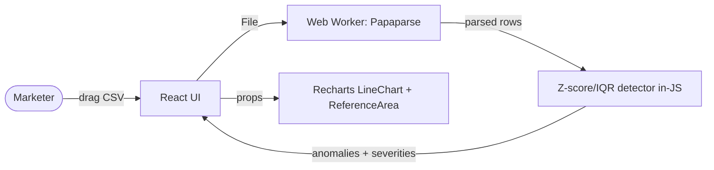

# Example Spec — Ad Spend Anomaly Detector

An abbreviated, filled reference spec showing house style. Generated from `projects/ad-spend-anomaly-detector/idea.md` + `prd.md` (both present as of 2026-04-20; no lean-canvas, gtm-plan, pre-mortem, or user-stories existed at drafting time — most assumptions tagged `[INFERRED]`).

Full specs run through all 23 sections. This example abbreviates §11–§17 to conserve space; a real `/spec <name>` run fills every section with the depth shown in §0, §7, §9, §18, §20.

---

```markdown
---
title: "Spec: Ad Spend Anomaly Detector"
project: ad-spend-anomaly-detector
date: 2026-04-20
status: draft
author: Dominik Benger
stage: idea
revision: 1
supersedes: []
confidence: mixed
inferred_count: 6
system_shape: web-app
primary_stack: "Next.js 15 + React 19 + Recharts + Papaparse + Tailwind — no backend, runs entirely in browser"
sources:
  - projects/ad-spend-anomaly-detector/idea.md
  - projects/ad-spend-anomaly-detector/prd.md
related_adrs: []
---

# Ad Spend Anomaly Detector — Technical Spec

## 0. TL;DR

A single-page web tool that parses marketer-uploaded CSVs of daily campaign data and flags statistical anomalies on a time-series chart. Built for solo performance marketers who want to spot budget waste in seconds instead of scanning dashboards. Runs entirely in the browser via Papaparse + in-JS Z-score/IQR detection + Recharts — no server, no accounts, no storage. Ships in 2 days.

## 1. Goals & Non-Goals

**Goals**
- G1: System detects and displays top 3 anomalies within 30 seconds of CSV upload (KR1).
- G2: Detections match expectations on seeded test datasets as judged by manual review (KR2).
- G3: Working MVP ships within 2 days of dev time (KR3).

**Non-Goals**
- NG1: Real-time monitoring or alerting — reason: prd.md §7 Non-Goals, adds server + auth + storage complexity.
- NG2: Machine-learning models — reason: Z-score hits target accuracy at zero variable cost.
- NG3: Data persistence / historical tracking — reason: stateless tool keeps scope at 2 days.

## 2. Assumptions & Constraints

**Assumptions**

| # | Assumption | Source | Risk if wrong | How we'll validate |
|---|-----------|--------|---------------|--------------------|
| A1 | Users have CSV exports (no live API needed for MVP) | prd.md §6.6 | pivot to Google Ads OAuth | user feedback after M2 |
| A2 | Z-score/IQR matches realistic expectations on ad data | prd.md §6.6 | switch to isolation-forest | manual review M1 |
| A3 | In-browser detection is fast enough for ≤10k rows | inferred | move parsing to WASM or worker | benchmark in M1 with synthetic CSV |
| A4 | No PII in uploaded CSVs (campaign IDs only) | inferred | add scrubbing + warning banner | review first 10 real uploads |

> _INFERRED — A3, A4 confidence low; rerun with --ask after user research._

**Constraints**

| Type | Constraint | Source |
|------|-----------|--------|
| Time | 2 days dev (~16 hrs) | idea.md `estimated_time: 960` minutes |
| Budget | $0 infra — static hosting only | inferred (no lean-canvas) |
| Skill | Strong: React, data analysis. Weak: ML ops — so avoid anything beyond z-score/IQR | author context |
| Data/Regulatory | None — data never leaves browser | design choice |

## 3. Success Criteria (build-level)

| PRD Metric | Spec element that enables it | Instrumentation | Cadence |
|-----------|------------------------------|-----------------|---------|
| Time to identify anomalies < 30s (KR1) | Upload → parse → detect → chart in one synchronous pipeline (§7) | `performance.now()` wrapper around pipeline, log to console in dev | Per-upload |
| Detection accuracy matches expectations (KR2) | §8 `feedback` type captures thumbs up/down per anomaly | local `useState` + download button to export feedback JSON | Weekly manual review |
| Build time ≤ 2 days (KR3) | Walking skeleton M1 by EOD1 gates M2 by EOD2 (§19) | git tag `v0.1.0-walking-skeleton` at M1 | Per-milestone |

## 4. Key User Flows

### 4.1 Happy path — upload → see anomalies
*Realizes: prd.md §6.3 US-001, US-002*

1. User: lands on single-page app, sees drag-drop zone and sample-data link.
2. User: drags CSV file onto zone (or clicks picker).
3. System: parses via Papaparse in worker; auto-detects columns by header name.
4. System: renders preview table with first 10 rows + detected column mapping; user can override mapping via dropdowns.
5. User: clicks "Detect anomalies."
6. System: runs Z-score per numeric column; renders Recharts line chart with anomaly bands highlighted and severity badges.
7. User: clicks anomaly point → inline popover with severity + suggested cause dropdown.

### 4.2 First-run / onboarding
1. System: shows "Try with sample data" button alongside upload zone.
2. User: clicks "Try with sample data."
3. System: loads bundled `/fixtures/sample-spend.csv`, runs full flow, lands on populated chart in <2s.

### 4.3 Error recovery — malformed CSV
1. User: uploads CSV with no date column.
2. System: parse completes but column-detection fails to find a date field.
3. System: shows inline banner: "No date column detected. Map it manually below," with dropdown of parsed headers.
4. User: picks date column from dropdown.
5. System: re-runs detection pipeline.

## 5. Functional Requirements (build-ready)

- **FR-1 [P0]:** The system must parse CSV files with daily performance metrics.
  - Build note: `src/parse/csv.ts` — Papaparse with `header: true, dynamicTyping: true`; auto-detect column semantics via header-name heuristics (`date|spend|cost|impressions|clicks|conversions|ctr|cvr`).
  - Stories: US-001
- **FR-2 [P0]:** The system must run Z-score or IQR-based anomaly detection per metric column.
  - Build note: `src/detect/zscore.ts` exports `detect(series: number[], method: 'zscore'|'iqr'): Anomaly[]`; severity buckets at |z| > 2 (low), > 2.5 (medium), > 3 (high).
  - Stories: US-002
- **FR-3 [P0]:** The system must score anomalies by severity (low/medium/high).
  - Build note: severity is a derived field on the Anomaly type; rendered as badge in UI.
  - Stories: US-002
- **FR-4 [P0]:** The system must render a time-series chart with highlighted anomaly zones.
  - Build note: Recharts `LineChart` + `ReferenceArea` for anomaly bands; severity controls band color.
  - Stories: US-002
- **FR-5 [P1]:** The system must display root-cause suggestions per anomaly.
  - Build note: static lookup table mapping (metric, direction) → cause hypotheses (e.g., spend-up + CTR-down → "creative fatigue").
  - Stories: — (deferred to M3)

## 6. UX / UI Notes

### 6.1 Screens

**Single page — `/`**
- Layout (top→bottom): title/description → upload zone + "Try sample" link → (once parsed) column-mapping row → metric selector + chart → anomaly list below chart.
- Key elements: drag-drop zone, file picker, sample button, column-mapping dropdowns, metric selector (radio buttons), anomaly popover.
- States:
  - Default (pre-upload): drag-drop zone with copy, "or try with sample data" link.
  - Loading (parsing/detecting): progress bar + "Parsing 2,148 rows…" / "Running Z-score detection…".
  - Empty (zero anomalies found): chart renders with message "No anomalies detected. Try lowering sensitivity."
  - Error (malformed CSV): inline banner with manual column-mapping.

### 6.2 Cross-cutting UI rules
- Loading: parsing >300ms shows progress bar with row count.
- Errors: single-sentence copy + a verb (e.g., "Map the date column manually below.").
- Accessibility: full keyboard nav, AA contrast, aria-labels on anomaly points and severity badges.

## 7. System Architecture



**Component responsibilities**

| Component | Responsibility | Owner / Location |
|-----------|---------------|------------------|
| React UI | Render screens, manage state, drive pipeline | `src/app/page.tsx` |
| Worker | Off-thread CSV parse | `src/workers/parse.worker.ts` |
| Detector | Pure-function anomaly detection | `src/detect/` |
| Chart | Visualization | `src/components/Chart.tsx` |

No backend. No database. Data never leaves the browser.

## 8. Data Model

No persistent storage. Transient in-memory shapes only:

### 8.1 Type: `Row`
| Field | Type | Constraints | Notes |
|-------|------|------------|-------|
| date | string (ISO-8601) | required | parsed from detected date column |
| spend | number \| null | optional | `null` for missing values |
| impressions | number \| null | optional | |
| clicks | number \| null | optional | |
| conversions | number \| null | optional | |

### 8.2 Type: `Anomaly`
| Field | Type | Constraints | Notes |
|-------|------|------------|-------|
| metric | `'spend' \| 'ctr' \| ...` | required | which metric flagged |
| date | string (ISO-8601) | required | anomaly point |
| zscore | number | required | magnitude signal |
| severity | `'low' \| 'medium' \| 'high'` | required | derived from zscore |
| suggestedCause | string \| null | optional | from static lookup |

No relationships (flat types). No lifecycle (anomalies are ephemeral).

## 9. API / Interface Contracts

N/A for HTTP — no backend. Module interfaces:

### 9.1 Detector module

```ts
// src/detect/zscore.ts
export type Anomaly = { metric: string; date: string; zscore: number; severity: 'low'|'medium'|'high' };
export function detect(series: Array<{ date: string; value: number }>, opts?: { threshold?: number }): Anomaly[];
```

Failure modes: empty series → `[]`; all-same values → `[]` (no variance).

### 9.2 Parser module

```ts
// src/parse/csv.ts
export type ColumnMap = { date: string; spend?: string; impressions?: string; clicks?: string; conversions?: string };
export function parse(file: File): Promise<{ rows: Row[]; columnMap: ColumnMap; detectedAutomatically: boolean }>;
```

Failure modes: no date column detectable → resolves with `detectedAutomatically: false` (UI prompts for manual map); parse error → rejects with structured error object.

## 10. External Integrations

N/A — no external services. Papaparse, Recharts, Tailwind bundled at build time. No network calls post-load.

## 11. Deployment & Environments

**Deployment target:** Vercel (static export) — chosen for zero-config CI + edge CDN.

| Environment | URL | Data store | Notes |
|-------------|-----|-----------|-------|
| Local dev | `localhost:3000` | none | `pnpm dev` |
| Production | `[vercel-url].vercel.app` | none | auto-deploy on `main` push |

Staging: not used for this project.

**Run locally in one command:** `pnpm dev`.

## 12. Configuration & Secrets

N/A — no secrets or env vars. No remote services to authenticate against.

## 13. Observability

Right-sized: single-page static app, no server.
- **Logs:** `console.log` in dev, stripped in prod build.
- **Metrics:** none.
- **Traces:** none — React DevTools for component profiling.
- **Operator alerts:** none — Vercel delivery status visible in their dashboard.

## 14. Performance & Scale

**Expected MVP load:** 1–5 users (self + sharing with peers), CSV sizes up to 10k rows, no concurrent usage.

**SLOs:** parse + detect + chart-render < 3s p95 for 10k-row CSV on M1 MacBook.

| Bottleneck | Mitigation |
|-----------|-----------|
| UI-thread parsing stalls at >10k rows | Move Papaparse into a Web Worker (FR-1 build note) |
| Z-score loop O(n × metrics) visible stutter | pre-compute means/stdevs once per metric |

## 15. Security & Privacy

**Authentication:** none — no user accounts.
**Authorization:** none — no server resources.
**Data handling:** CSV data never leaves the browser. No PII expected (campaign IDs only per A4).
**Threat model:** 
1. User uploads PII accidentally (email in a custom column) — mitigation: banner on upload: "Data stays in your browser. We never upload it." > _INFERRED — no pre-mortem.md_
2. Malicious CSV triggers parse DoS — mitigation: Papaparse row-limit safeguard (100k rows).
3. XSS via CSV cell contents rendered in popover — mitigation: render via React's default text escaping only; never use raw-HTML injection APIs.

**Compliance:** none — no data collection.

### 15.A AI Behavior Contract

N/A — no model-call surface in MVP. Detection runs on pure Z-score / IQR math in `src/detect/zscore.ts`; no LLM, no embeddings, no third-party inference service. ADR-3 (§18) rejected LLM-scored anomaly explanations in favor of a static lookup table. If ADR-3 revisits (static lookup accuracy < 60%), §15.A must be filled with the 5/5/6 behavior contract before shipping model-call code.

## 16. Testing Strategy

| Lane | Scope | Tooling | Frequency |
|------|-------|---------|-----------|
| Unit | detector math, column-heuristic matching, severity buckets | vitest | watch + pre-commit |
| Integration | parse → detect → chart props end-to-end with fixture CSV | vitest + jsdom | CI on PR |
| E2E | upload sample, click anomaly, see popover | Playwright | manual before release tag |
| Manual | visual smoke on real-world CSV, check chart legibility | human | before each release |

**Explicitly not tested:** cross-browser (Chrome + Safari only), mobile viewport (desktop-first MVP).

## 17. Rollout & Migration

**Release plan:** ship to `main` → Vercel prod. Share URL with 3 performance-marketer peers for feedback in week 1.
**Data migrations:** N/A — no data.
**Rollback:** `git revert <sha> && push` — Vercel auto-redeploys.

## 18. Considered & Rejected Alternatives (ADR)

### ADR-1: Server-side detection in Python (pandas + scipy)
- **Considered because:** richer stats libs, easier to add ML models later.
- **Rejected because:** adds backend + deploy + auth + data-residency concerns for zero MVP benefit; Z-score in JS is 20 lines.
- **Revisit when:** user demand for detection methods beyond Z-score/IQR exceeds what's feasible in JS.

### ADR-2: Google Ads API integration instead of CSV upload
- **Considered because:** eliminates export step for users.
- **Rejected because:** OAuth + per-user API quotas + data residency concerns turn a 2-day project into a 2-week project (A1 assumption).
- **Revisit when:** A1 fails — users ask for live connection in week-1 feedback.

### ADR-3: LLM-scored anomaly explanations instead of static lookup
- **Considered because:** better contextual cause suggestions.
- **Rejected because:** $ per call, variable latency breaks KR1 (<30s SLO), and static lookup covers the top 80% of cases.
- **Revisit when:** static lookup accuracy <60% on real-user feedback in M3.

## 19. Milestones & Phasing

### M1 — Walking skeleton (~day 1, ~8h)
**Exit criteria:** Sample CSV loads → Z-score detects anomalies on spend column → chart renders anomaly bands → demo to self. Tagged `v0.1.0-walking-skeleton`.
**Stories:** FR-1, FR-2, FR-3, FR-4 (happy path only).

### M2 — MVP (~day 2, ~8h)
**Exit criteria:** All 4 P0 FRs working. Multi-metric support. Severity badges. Column-mapping override. Ship to Vercel. Share URL with 3 peers.
**Stories:** FR-1 through FR-4 complete, error-recovery flow §4.3.

### M3 — Phase 2 polish (post-MVP, time-permitting)
**Exit criteria:** FR-5 root-cause dropdown. Multi-metric correlation analysis. Configurable sensitivity threshold.
**Stories:** FR-5 + enhancements from prd.md §7 Phase 2+.

## 20. First-Week Tasks

1. Scaffold Next.js app: `pnpm create next-app@latest ad-spend-anomaly-detector --ts --tailwind --app --no-eslint`; initial commit.
2. Add Papaparse + Recharts; create stub pages with drag-drop zone.
3. Implement `src/parse/csv.ts` with column-name heuristics; unit tests against `fixtures/sample-spend.csv`.
4. Implement `src/detect/zscore.ts`; 3 unit tests (empty, flat, spike).
5. Wire pipeline: upload → parse → detect → log results to console.
6. Build `src/components/Chart.tsx` rendering LineChart + ReferenceArea anomaly bands.
7. Tag `v0.1.0-walking-skeleton`; demo to self — M1 complete.
8. Add multi-metric selector, severity badges, column-mapping override UI.
9. Add error-recovery flow §4.3 + sample-data button.
10. Deploy to Vercel, share URL with 3 peers. M2 complete.

## 21. Open Questions

- [Owner: self] [blocks M2: no] What sensitivity default balances catching real anomalies vs. false positives? (prd.md §9 carried forward)
- [Owner: user-research] [blocks M3: no] Should the tool support multi-metric correlation (spend spike + CTR drop)? (prd.md §9)
- [Owner: self] [blocks M1: yes] Confirm A3 — is in-browser detection fast enough for 10k rows, or does it need a worker from day 1?
- [Owner: self] [blocks M2: yes] Confirm A4 — review first 3 real CSVs for unexpected PII.

## 22. Changelog

- 2026-04-20 — initial draft, sourced from `idea.md` + `prd.md`. Confidence: mixed (6 INFERRED tags).

## 23. Appendix: References

**Project artifacts**
- `projects/ad-spend-anomaly-detector/idea.md` — original scope
- `projects/ad-spend-anomaly-detector/prd.md` — product requirements (primary contract)

**External docs**
- [Papaparse docs](https://www.papaparse.com/docs)
- [Recharts API](https://recharts.org/en-US/api)
- [Next.js App Router](https://nextjs.org/docs/app)

**Prior art**
- Google Ads automated rules (threshold-based) — what this improves on.
- `isolation-forest` npm package — considered (ADR-1) and deferred.

**Goal alignment**
- GOALS.md › Build & ship 10 products › KR: ship a new product every 3 weeks
- GOALS.md › Build custom analytical solutions › KR: ship 3 statistical tools in 2026
```
