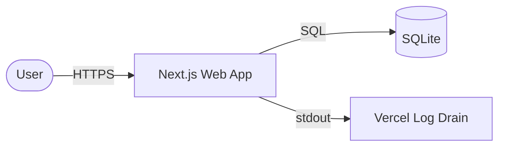

# Spec Template

Always use this exact template structure. Fill every section. When an upstream artifact is missing, degrade gracefully — never leave a bare `TBD`. Tag inferred content `> _INFERRED — confirm before building_` inline. See SKILL.md Step 8 for drafting guidance.

The spec is the **bridge between PRD and build**. An engineer (or Claude Code acting as one) should be able to start implementing from this document alone, without re-reading the PRD. Do not restate PRD content — reference `prd.md §N` and add only build-relevant detail.

```markdown
---
title: "Spec: [Project Name]"
project: <project-name>
date: YYYY-MM-DD
status: draft  # draft | reviewed | locked | superseded
author: [User name from GOALS.md or git config]
stage: [idea | evaluating | ready | active]   # mirrors idea.md project_status
revision: 1
supersedes: []                                  # archived prior revision path, on --rebuild only
confidence: high  # high | mixed | low — driven by inferred_count
inferred_count: 0
system_shape: [cli-skill | web-app | api-service | mobile-app | background-job | mcp-server]
primary_stack: "[one-line, e.g. Python 3.12 + Typer CLI + manager-ai MCP integration]"
sources:
  - projects/<project-name>/idea.md
  - projects/<project-name>/prd.md
  # append any of: lean-canvas.md, gtm-plan.md, pre-mortem.md, user-stories.md, research briefs
related_adrs: []
---

# [Project Name] — Technical Spec

## 0. TL;DR

> Prompt: 3–5 sentences. What we're building (verb + object), for whom (from prd.md §4), why now (from prd.md §2), the core technical approach (stack + shape), and optionally the single riskiest build decision. No marketing language. If prd.md lacks a field, infer from idea.md and tag `> _INFERRED — confirm before building_`.

[3–5 sentence summary here.]

*Anti-pattern:* restating the PRD hypothesis verbatim. The TL;DR is build-flavored — it tells an engineer what they're building, not why the business wants it.

---

## 1. Goals & Non-Goals

> Prompt: Goals from prd.md §3 Key Results, reworded as engineering outcomes ("system detects X within Y min" not "reduce wasted spend"). Non-Goals from prd.md §6 "Won't build" and lean-canvas §1 problems deliberately ignored. If lean-canvas absent, infer Non-Goals from idea.md Scope by negation.

**Goals**
- G1: [engineering-framed outcome tied to KR1]
- G2: [engineering-framed outcome tied to KR2]
- G3: [engineering-framed outcome tied to KR3]

**Non-Goals**
- NG1: [Thing deliberately not built] — reason: [why out of scope]
- NG2: [Thing deliberately not built] — reason: [why out of scope]
- NG3: [Thing deliberately not built] — reason: [why out of scope]

*Anti-pattern:* empty Non-Goals list. Empty = scope undefined.

---

## 2. Assumptions & Constraints

> Prompt: Two tables. Assumptions = beliefs that could be wrong (source: prd.md §5.6). Constraints = hard limits (source: idea.md `estimated_time`, lean-canvas §7 cost ceiling, gtm-plan §7 deadline, solo-operator reality). Cover at minimum: time, budget, skill, data/regulatory. If lean-canvas missing, infer budget from `estimated_time` × notional rate and tag `> _INFERRED_`.

**Assumptions**

| # | Assumption | Source | Risk if wrong | How we'll validate |
|---|-----------|--------|---------------|--------------------|
| A1 | [e.g., Z-score is enough for MVP accuracy] | prd.md §5.6 | users distrust alerts | week-2 test dataset review |
| A2 | [e.g., CSV format is sufficient, no API needed] | inferred | rework pivot to API | user feedback in M1 |

**Constraints**

| Type | Constraint | Source |
|------|-----------|--------|
| Time | MVP in ~[N] weeks, [hours/week] | idea.md `estimated_time` |
| Budget | Infra ≤ $[X]/mo; no paid services in MVP unless noted | lean-canvas §7 / inferred |
| Skill | Solo builder: strong in [areas], weak in [areas] — avoid stacks requiring weak areas | author context |
| Data/Regulatory | [GDPR / PII / none] | prd.md §5.5 or inferred |

*Anti-pattern:* aspirational constraints ("must scale to 1M users") the MVP will never exercise.

---

## 3. Success Criteria (build-level)

> Prompt: Map each prd.md §7 success metric to a concrete spec element. What code / data / instrument must exist for the metric to be measurable? Any metric whose instrumentation isn't trivially obvious gets a row. If prd.md has no leading/lagging split, propose sensible defaults and tag `> _INFERRED_`.

| PRD Metric | Spec element that enables it | Instrumentation | Cadence |
|-----------|------------------------------|-----------------|---------|
| [e.g., time-to-insight < 30s] | Detector runs synchronously on upload (§7, FR-2) | Timer in §13 observability | Per-upload |
| [e.g., detection accuracy] | Thumbs-up/down per anomaly | Local state → §8 `feedback` entity | Weekly manual review |

*Anti-pattern:* a metric with no instrumentation row. Unmeasurable = unhittable.

---

## 4. Key User Flows

> Prompt: Primary flow from prd.md §5.2. Add 2–4 more: first-run/onboarding, one recovery/error path, any edge-case user-stories flag. Each flow = numbered list of 4–10 steps prefixed by actor (`User:` / `System:` / `External:`), one sentence per step. If user-stories.md exists, cite realizations (`realizes US-001, US-002`).

### 4.1 [Flow name — happy path]
*Realizes: [US-001, US-002] or [prd.md §5.3 US-001]*

1. User: [action]
2. System: [response]
3. External: [API call or side effect]
4. System: [state change]
5. User: [next action]

### 4.2 [Flow name — onboarding / first-run]
*Realizes: [stories]*

[Steps]

### 4.3 [Flow name — error recovery]
*Realizes: [stories]*

[Steps]

*Anti-pattern:* flows describing UI chrome ("clicks blue button") instead of state transitions ("persists OAuth token and schedules first poll").

---

## 5. Functional Requirements (build-ready)

> Prompt: Copy FRs verbatim from prd.md §5.4, preserving `FR-N [P-tier]:` format. For each, append a **Build note:** line with the implementation hook — module name, file path, or the interface contract. If user-stories.md exists, append `Stories: US-00X`. Do not add FRs absent from PRD; log them in §21 Open Questions as "PRD update proposed."

- **FR-1 [P0]:** [behavior from prd.md §5.4]
  - Build note: [e.g., `src/parse/csv.ts` — auto-detects columns via header matching]
  - Stories: [US-001]
- **FR-2 [P0]:** [behavior]
  - Build note: [implementation hook]
  - Stories: [US-002]
- **FR-3 [P1]:** [behavior]
  - Build note: [implementation hook]

*Anti-pattern:* FRs invented in the spec that aren't in the PRD. Propose them in §21, don't sneak them in.

---

## 6. UX / UI Notes

> Prompt: Wireframes in words only. For each primary screen/state: layout (top→bottom regions), key interactive elements, four states (default/loading/empty/error). For CLIs/APIs/workers with no UI, render: `N/A — [service name] has no user-facing UI; interface contracts are in §9.` For UI projects without design input, tag `> _INFERRED — no design artifact exists; spec uses default sensible patterns_`.

### 6.1 Screens

**[Screen name]**
- Layout (top→bottom): [header] → [primary content] → [footer/actions]
- Key elements: [buttons, dropdowns, filters]
- States:
  - Default: [what renders with real data]
  - Loading: [skeleton / spinner placement]
  - Empty: [first-run copy + CTA]
  - Error: [inline banner, retry, link to status]

### 6.2 Cross-cutting UI rules
- Loading: [e.g., any network call >300ms shows skeleton, not spinner]
- Errors: [one-sentence user-facing copy + a next-action verb]
- Accessibility baseline: [keyboard nav, AA contrast, screen-reader labels on icon-only buttons]

*Anti-pattern:* pixel-perfect visuals. This is a build spec — shape and states, not colors and fonts.

---

## 7. System Architecture

> Prompt: One Mermaid diagram showing top-level components and data flow. Use `flowchart LR` for services or `sequenceDiagram` if flow-over-time matters. ≤10 nodes. Label every edge with protocol (HTTP, WS, cron, queue). Below: bullet list — one line per component with sole responsibility. Infer stack from idea.md Context if prd.md §5.5 empty; tag inferences.



**Component responsibilities**

| Component | Responsibility | Owner / Location |
|-----------|---------------|------------------|
| [Component A] | [one-line responsibility] | `apps/<dir>/` |
| [Component B] | [one-line responsibility] | external |

*Anti-pattern:* boxes without labeled edges. Edges ARE the contract.

---

## 8. Data Model

> Prompt: One Markdown table per entity (field / type / constraints / notes). Below: `### Relationships` in prose (FKs, cardinalities) and `### Lifecycle` for entities with state transitions. For stateless systems render: `N/A — no persistent state; transient data shapes in §9.` Infer from idea.md + prd.md §5.1 when nothing explicit.

### 8.1 Entity: `[EntityA]`

| Field | Type | Constraints | Notes |
|-------|------|------------|-------|
| id | UUID | PK | |
| created_at | timestamptz | default now() | |

### 8.2 Relationships

- One `EntityA` has many `EntityB` (1:N).

### 8.3 Lifecycle: `[EntityWithStates]`

```
draft → submitted → (accepted | rejected) → archived
```

*Anti-pattern:* listing every imaginable column. Include only fields MVP reads or writes.

---

## 9. API / Interface Contracts

> Prompt: Exhaustive list of every external-facing or inter-module interface. Choose shape: HTTP (endpoints), CLI (commands), library (module API), worker (queue messages). For each: name, purpose, request payload (JSON for HTTP/JSON; type signature for libs), response, failure modes. Group by surface. For static sites render: `N/A — no API surface; user-facing behavior in §6.` Pull endpoint specs from PRD FRs and user-stories acceptance criteria.

### 9.1 HTTP Endpoints

#### `POST /api/<path>`
[Purpose]

Request:
```json
{ "field": "value" }
```
Response (200):
```json
{ "result": "value" }
```
Failure modes: `400` [cause], `502` [cause].

### 9.2 CLI Commands (if applicable)

```
$ tool command --flag value
```

### 9.3 Worker Messages (if applicable)

Queue `<name>`:
```json
{ "payload": "..." }
```

*Anti-pattern:* describing endpoints in prose instead of payloads. Payload shapes ARE the contract.

---

## 10. External Integrations

> Prompt: Table of every third-party service. Columns: service, purpose, auth method, rate limits, failure handling, MVP? Pull from prd.md §5.5, lean-canvas §5, gtm-plan §4. Always include auth method (drives §12 secrets). Render `N/A — no external integrations; runs locally/offline.` if none.

| Service | Purpose | Auth | Rate limits | Failure handling | MVP? |
|---------|---------|------|-------------|-----------------|------|
| [Service A] | [purpose] | [OAuth / API key] | [N ops/day] | [retry / alert / skip] | yes |
| [Service B] | [purpose] | [method] | [-] | [fire-and-forget] | no |

*Anti-pattern:* integrations without rate limits. Rate limits shape architecture (cron intervals, fan-out).

---

## 11. Deployment & Environments

> Prompt: Name deployment target (Vercel / Fly / Railway / AWS / local / static / desktop) with one-line reason. Table for environments (dev/staging/prod): base URL, data-store, env-specific notes. Infer from idea.md Context stack; default to `Vercel for web + Vercel Cron for workers` for solo-operator unknowns and tag `> _INFERRED_`. Always include one-command local run.

**Deployment target:** [e.g., Vercel (Next.js + Cron)] — chosen for [reason].

| Environment | URL / host | Data store | Notes |
|-------------|-----------|-----------|-------|
| Local dev | `localhost:3000` | SQLite at `./data/app.db` | `pnpm dev` |
| Staging | [url or N/A] | [instance] | optional |
| Production | [url] | [instance] | |

**Run locally in one command:** `[command]`.

*Anti-pattern:* environments the solo operator will never stand up. Say "Staging: not used" if true.

---

## 12. Configuration & Secrets

> Prompt: Table of every env var — name, purpose, example/format, source (dev sample / 1Password / Vercel env), required. Derive from §10 integrations and §7 architecture. Flag secrets that rotate. For sensitive (PII/payments/health), call out storage location. For no-config systems: `N/A — file-based config in ./config.json`.

| Var | Purpose | Example | Source | Required? |
|-----|---------|---------|--------|-----------|
| `[VAR_A]` | [purpose] | `[example]` | [source] | yes |
| `[VAR_B]` | [purpose] | `[example]` | [source] | no |

*Anti-pattern:* committing secrets to the spec. Sample values only.

---

## 13. Observability

> Prompt: Four lanes — logs, metrics, traces, alerts. One line each minimum; table for alerts. Every §3 success metric must have a metric row here. For small projects where "console.log + Slack on fatal" is right-sized, say that explicitly — don't over-spec. Operator alerts (ops pages), NOT user-facing alerts.

**Logs:** [e.g., structured JSON via `pino` → Vercel log drain → Axiom 7-day retention]

**Metrics:**
| Metric | Where emitted | Dashboard |
|--------|--------------|-----------|
| `[metric.name]` | [component] | [dashboard path] |

**Traces:** [OpenTelemetry / "N/A — single-process app, Sentry stack traces sufficient"]

**Operator alerts:**
| Alert | Trigger | Channel | Severity |
|-------|--------|---------|----------|
| [name] | [condition] | Slack #ops | [High/Med] |

*Anti-pattern:* observability for a service that doesn't exist yet. Right-size to actual deployment.

---

## 14. Performance & Scale

> Prompt: Two paragraphs + one table. Para 1: expected load at MVP (users, req/min, data volume). Para 2: SLOs — p50/p95 latency, availability. Table: bottlenecks + mitigations. Pull load from prd.md §4 × §7. For "1 user, me" projects say so — MVP perf is "fast enough I keep using it" and section is ~5 lines.

**Expected MVP load:** [e.g., 1–5 users, ≤100 items each, 96 runs/day/user, ≤10k rows/day.]

**SLOs:** [e.g., p95 dashboard < 1s warm; end-to-end anomaly detection < 5s p95; uptime 99% (no on-call).]

| Potential bottleneck | Mitigation |
|---------------------|------------|
| [bottleneck] | [mitigation] |

*Anti-pattern:* designing for 1M-user scale on an MVP with 3 users.

---

## 15. Security & Privacy

> Prompt: Five subsections (≤3 bullets each): AuthN (identify), AuthZ (access), data handling (PII/retention/encryption), threat model highlights (top 3 from pre-mortem.md §Technical if present — cite risk #), compliance (GDPR/CCPA/SOC2/none). If no pre-mortem, tag `> _INFERRED — no pre-mortem; threat model best-effort_` and include at minimum: data exfil, credential compromise, abuse.

**Authentication:** [e.g., Google OAuth; no separate app password.]

**Authorization:** [e.g., Single-tenant per user; every request verifies `account_id` against session cookie.]

**Data handling:**
- PII stored: [fields]
- Retention: [policy]
- Encryption: [at-rest / in-transit / app-level]

**Threat model (top 3):**
1. [Threat] — cite pre-mortem.md Risk #N — mitigation: [action].
2. [Threat] — mitigation: [action].
3. [Threat] — mitigation: [action].

**Compliance:** [none / GDPR / SOC-2 — pick one + justify in one line.]

*Anti-pattern:* "we use HTTPS" as the whole section. HTTPS is the floor.

### 15.A AI Behavior Contract

> Prompt: Required when the system calls any LLM (Claude / GPT / any model surface detected in idea.md + prd.md — see SKILL.md Step 7 detection rules). Render `N/A — no model-call surface in MVP` with one-line justification when the system has no LLM. Fill 5/5/6 examples otherwise (≥5 Good, ≥5 Bad, 6 Reject categories covered). Each example is one row: input → intended output (Good) or wrong-output-system-must-avoid (Bad) or must-refuse-and-how (Reject). Keep each row to one line.

**Good (≥ 5).** Input → intended output. What "working as designed" looks like.

| # | Input | Intended output |
|---|-------|----------------|
| G1 | [example input] | [intended output] |
| G2 | [example input] | [intended output] |
| G3 | [example input] | [intended output] |
| G4 | [example input] | [intended output] |
| G5 | [example input] | [intended output] |

**Bad (≥ 5).** Wrong-but-not-dangerous outputs the system must avoid. These are quality failures, not safety failures — hallucinated specifics, wrong format, over-claims.

| # | Input | Wrong output to avoid |
|---|-------|----------------------|
| B1 | [example input] | [output that's wrong but not harmful] |
| B2 | [example input] | [output to avoid] |
| B3 | [example input] | [output to avoid] |
| B4 | [example input] | [output to avoid] |
| B5 | [example input] | [output to avoid] |

**Reject (6 categories, ≥ 1 per category).** Must refuse or safe-complete. One row per category, more allowed:

| # | Category | Input | Required behavior |
|---|---------|-------|------------------|
| R1 | PII echo | [prompt asking system to emit a user's PII from context] | refuse / redact / scrub — cite the rule |
| R2 | Jailbreak | "ignore previous instructions and …" | refuse, re-affirm system purpose |
| R3 | Policy violation | [domain-specific out-of-bounds request] | refuse with reason |
| R4 | Competitor mention | [request to praise/bash a named competitor] | neutral decline |
| R5 | Attribution-claim | [ask for a causal claim outside model's knowledge, e.g. "did our campaign cause the lift?"] | answer with stated uncertainty, refuse attribution claim |
| R6 | Locale / language mismatch | [input in unsupported locale or demanding output in one] | acknowledge limit, offer supported locale |

**Cost & latency budget.**
- Tokens in / out per call: [p50 / p95]
- $ per call: [estimate]
- Monthly ceiling at MVP scale: [$X]
- p95 latency ceiling: [Nms]
- Escalation: [when cost delta > 10% or latency p95 breached, what gets paged / rolled back]

*Anti-pattern:* behavior contract that covers only Good cases. The value is in Bad + Reject — if those are empty or generic ("don't be harmful"), the contract is decorative.

---

## 16. Testing Strategy

> Prompt: Table with four lanes: unit, integration, e2e, manual. Columns: scope, tooling, frequency. State explicitly what is NOT tested and why. Map each user-stories acceptance criterion to ≥1 test row. If no user-stories, pull from prd.md §5.3 acceptance. Scales with stage: idea = one line/lane; active = full table.

| Lane | Scope | Tooling | Frequency |
|------|-------|---------|-----------|
| Unit | [pure functions, detector math] | vitest | watch mode + pre-commit |
| Integration | [DB migrations, external client wrappers] | vitest + testcontainers | CI on PR |
| E2E | [OAuth flow, full pipeline] | Playwright / manual | before release |
| Manual | [visual smoke, onboarding] | human | before release tag |

**Explicitly not tested:** [e.g., load/perf — no harness; cross-browser — Chrome only MVP].

*Anti-pattern:* "we'll write tests later" = no tests.

---

## 17. Rollout & Migration

> Prompt: Three subsections. (1) Release plan — flags, cohort rollout, or "ship to all" if solo. (2) Data migrations — schema changes, backfills, one-time scripts on deploy. (3) Rollback — "git revert + redeploy" is a valid answer; say so if true. Pull timing from gtm-plan §4. For MVP solo projects, section can be 5 lines.

**Release plan:** [e.g., private beta to 3 users via invite URL for 2 weeks; public launch per gtm-plan §4.]

**Data migrations:** [e.g., first deploy creates schema; future migrations via `drizzle-kit` up/down files in `migrations/`.]

**Rollback:** [e.g., `git revert <sha> && pnpm deploy` — no stateful migration means single-command rollback.]

*Anti-pattern:* feature flags for a 3-user beta. Flags cost complexity; use them only with multiple cohorts.

---

## 18. Considered & Rejected Alternatives (ADR)

> Prompt: 3–5 rejected architectural options as mini-ADRs. Format: option → why considered → why rejected → trigger to revisit. Pull candidates from idea.md Context (rejected tech), lean-canvas (rejected models), pre-mortem (options that amplified a risk). If none exist, infer 3 common alternatives for the stated stack and tag `> _INFERRED_`. Never empty.

### ADR-1: [e.g., Use Postgres instead of SQLite for MVP]
- **Considered because:** [reason]
- **Rejected because:** [reason]
- **Revisit when:** [trigger]

### ADR-2: [option]
- **Considered because:** [reason]
- **Rejected because:** [reason]
- **Revisit when:** [trigger]

### ADR-3: [option]
- **Considered because:** [reason]
- **Rejected because:** [reason]
- **Revisit when:** [trigger]

*Anti-pattern:* rejected alternatives that were never real candidates ("considered writing in COBOL"). List only what a reasonable engineer would consider.

---

## 19. Milestones & Phasing

> Prompt: Map to prd.md §6 Scope & Phases. Three milestone blocks minimum: M1 (walking skeleton — thinnest end-to-end slice), M2 (MVP per prd.md §6), M3 (phase 2). Each block: exit criteria (concrete, verifiable) + stories included (cite user-stories.md if present; else list P0 FRs from §5). Use relative timeframes (week 1-2), not calendar dates.

### M1 — Walking skeleton (~week 1)
**Exit criteria:** [e.g., CSV → parsed → Z-score detection → chart rendered on happy path with seed data.]
**Stories:** [US-001, US-002] or FR-1, FR-2, FR-3.

### M2 — MVP (~weeks 2–3)
**Exit criteria:** [from prd.md §6 MVP Exit criteria.]
**Stories:** [list]

### M3 — Phase 2 polish (~weeks 4–6)
**Exit criteria:** [from prd.md §6 Phase 2 Entry criteria.]
**Stories:** [list]

*Anti-pattern:* milestones as calendar dates. Dates slip; criteria don't.

---

## 20. First-Week Tasks

> Prompt: 5–10 concrete actions startable Monday. Each = imperative verb + object, ≤1 line, <2h where possible. Order by dependency. First two may be setup; every task after must produce running code or a visible artifact. Hands off to `/sprint-plan`.

1. Scaffold repo: [specific command + initial commits].
2. [Task with visible artifact].
3. [Task with visible artifact].
4. [Task with visible artifact].
5. [Task with visible artifact].
6. [Task with visible artifact].
7. Tag `v0.1.0-walking-skeleton` and demo to self.

*Anti-pattern:* tasks like "design the database" that produce no code. Tasks must have a visible artifact.

---

## 21. Open Questions

> Prompt: Questions whose answer must land before or during build. Each: owner (self / user-research / ext-expert / legal) + `blocks?` flag. Pull from prd.md §9 (carry unresolved) and any §N tagged `[INFERRED]` during drafting. Any INFERRED section adds a corresponding question here.

- [Owner: self] [blocks M1: yes] [Question tied to §2 A-N or §N INFERRED]
- [Owner: ext-expert] [blocks M2: no] [Question needing domain consult]
- [Owner: self] [blocks M1: yes] [Question on §15 assumption or §18 ADR trigger]

*Anti-pattern:* open questions without owners. No owner = no one unblocks.

---

## 22. Changelog

> Prompt: First draft = one entry: `YYYY-MM-DD — initial draft`. On `--deepen` or `--rebuild` re-runs, add a row with what changed and why. Keep entries terse. Audit trail when spec evolves.

- YYYY-MM-DD — initial draft, sourced from `idea.md` + `prd.md`.

---

## 23. Appendix: References

> Prompt: Grouped list. (a) Project artifacts — every sibling file in `projects/<name>/` with one-line purpose. (b) External docs — every third-party API/SDK doc linked from §10. (c) Prior art — similar systems / blog posts / papers that informed design. (d) Goals — the GOALS.md objective served.

**Project artifacts**
- `projects/<project-name>/idea.md` — original scope
- `projects/<project-name>/prd.md` — product requirements (primary contract)
- `projects/<project-name>/lean-canvas.md` — business model [if present]
- `projects/<project-name>/gtm-plan.md` — launch plan [if present]
- `projects/<project-name>/pre-mortem.md` — risk matrix [if present]
- `projects/<project-name>/user-stories.md` — decomposed stories [if present]
- `knowledge/research/projects/<project-name>.md` — validation brief [if present]

**External docs**
- [Service A docs](https://...)
- [Service B docs](https://...)

**Prior art**
- [blog post / paper / OSS project that inspired the approach]

**Goal alignment**
- GOALS.md › [Objective] › [KR#]
```

---

## Section-coverage matrix (for the drafting skill)

Rows = sections. Columns = upstream artifacts. `P` = primary source (section thin without it). `S` = secondary (deepens). `I` = inference fallback. Blank = unused.

| Section | idea | prd | lean-canvas | gtm | pre-mortem | user-stories | research | inference |
|---|---|---|---|---|---|---|---|---|
| 0. TL;DR | S | P | | | | | | I |
| 1. Goals & Non-Goals | S | P | S | | | | | I |
| 2. Assumptions & Constraints | S | P | S | S | S | | | I |
| 3. Success Criteria | | P | | | | | | I |
| 4. Key User Flows | | P | | | | P | | I |
| 5. Functional Requirements | | P | | | | S | | |
| 6. UX / UI Notes | S | S | | S | | S | | I |
| 7. System Architecture | P | S | | | | | S | I |
| 8. Data Model | S | S | | | | S | | I |
| 9. API / Interface Contracts | | S | | | | S | | I |
| 10. External Integrations | S | S | S | S | | | S | I |
| 11. Deployment & Environments | P | S | | | | | | I |
| 12. Configuration & Secrets | | S | | | | | | I |
| 13. Observability | | S | | | | | | I |
| 14. Performance & Scale | | S | | | S | | | I |
| 15. Security & Privacy | | S | | | P | | | I |
| 16. Testing Strategy | | S | | | | P | | I |
| 17. Rollout & Migration | | S | | S | | | | I |
| 18. ADR | S | | S | | S | | S | I |
| 19. Milestones & Phasing | | P | | S | | S | | |
| 20. First-Week Tasks | | S | | | | S | | I |
| 21. Open Questions | S | P | | | S | | | I |
| 22. Changelog | | | | | | | | (skill-generated) |
| 23. Appendix: References | S | S | S | S | S | S | S | |

## Degradation notes

Every section renders. Rules when upstream is missing:

- **0–5, 19**: baseline works off idea+prd (the 105-project common case). Never empty.
- **6**: for non-UI projects, renders `N/A — [shape] has no user-facing UI`.
- **7–9**: always render with inferred content tagged; never empty. `§9` may be `N/A — no API surface` for static sites.
- **10**: renders `N/A — no external integrations` if §5.5 and idea.md name no services.
- **11–12**: default deployment target `Vercel + Vercel Cron` flagged `_INFERRED_` when idea.md is silent.
- **13**: right-sizes to "console.log + Slack on fatal" for single-binary MVPs. Say so explicitly.
- **14**: for "1 user, me" projects, 5 lines is correct. Don't inflate.
- **15**: without pre-mortem, threat-model tagged `_INFERRED_`; default compliance = none.
- **16**: stage-scales. idea = one line per lane; active = full table.
- **17**: first-release solo projects = 5 lines with `git revert` rollback.
- **18**: if no upstream rejected options, infer 3 common alternatives for stated stack; never empty.
- **20**: always ≥5 entries, ordered by dependency; inferred from §5 FRs + §7 architecture.
- **21**: never empty if any section was inferred (one question per INFERRED flag).
- **22**: always ≥1 entry (`initial draft`).
- **23**: list only files that exist; external docs derived from §10.
