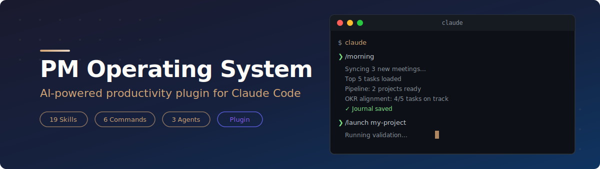
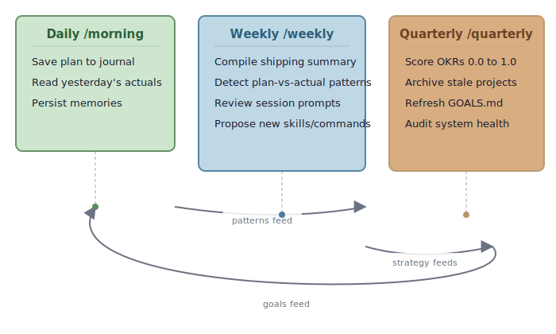

<div align="center">



</div>

<p align="center">
  <a href="https://opensource.org/licenses/MIT"></a>&nbsp;
  <a href="https://github.com/Ninety2UA/pm-operating-system/stargazers"></a>&nbsp;
  
</p>

<p align="center">
  <a href="#overview">Overview</a> &middot;
  <a href="#philosophy">Philosophy</a> &middot;
  <a href="#architecture">Architecture</a> &middot;
  <a href="#features">Features</a> &middot;
  <a href="#quick-start">Quick Start</a> &middot;
  <a href="#what-you-get">What You Get</a> &middot;
  <a href="#usage-examples">Usage</a> &middot;
  <a href="#configuration">Configuration</a>
</p>

---

## Overview

PM Operating System is a Claude Code configuration that gives your AI assistant a structured productivity layer. Instead of starting every session from scratch, your assistant knows your goals, tracks your tasks, evaluates your project ideas through a rigorous pipeline, and learns from each session to make the next one better.

**The workflow is simple:**

1. **Brain dump** into `BACKLOG.md` (no structure needed)
2. **Process** with `/process-backlog` to classify and deduplicate
3. **Evaluate** project ideas through a multi-stage pipeline (`/launch`)
4. **Execute** with daily standups, sprint plans, and weekly reviews
5. **Compound** knowledge across sessions, weeks, and quarters

---

## Philosophy

This project is built on a core insight from Andrej Karpathy's thinking about LLMs: that large language models are best understood not as chatbots, but as the **kernel of a new kind of operating system**.

> *"Think about it more like an operating system."*
>
> -- Andrej Karpathy, [Intro to Large Language Models (2023)](https://www.youtube.com/watch?v=zjkBMFhNj_g)

In his [Stanford talk](https://www.youtube.com/watch?v=c3b-JASoPi0) and subsequent writing, Karpathy describes a future where the LLM sits at the center, orchestrating tools, managing memory, and maintaining context across interactions. The model reads your files, understands your goals, uses tools to take action, and gets better over time.

**PM Operating System implements this vision literally:**

| LLM OS Concept | How It Works Here |
|---|---|
| **Strategic memory** | `GOALS.md` is read every session to prioritize your work |
| **Specialized capabilities** | 29 skills the LLM can invoke (validation, risk analysis, sprint planning, slide generation) plus 1 standalone command (`/analyze`) |
| **Recurring workflows** | Workflow skills (`/morning`, `/weekly`, `/quarterly`, `/process-backlog`, `/launch`, `/write`) for daily, weekly, and quarterly cycles |
| **Autonomous sub-processes** | 3 agents that run in the background (research, evaluation, diagnostics) |
| **Structured tool use** | MCP server with 10 tools for task and project management |
| **Long-term memory** | `knowledge/` compounds from daily journals to quarterly assessments |

The result: each session makes the next one more effective. Your assistant does not start from zero; it starts from everything it has learned about you, your goals, and your work.

---

## Architecture

### System Overview

<div align="center">


</div>

### Project Pipeline

When a project enters the pipeline via `/launch`, it passes through six evaluation stages with a Go/No-Go gate after each:

<div align="center">


</div>

> Each stage produces a markdown artifact saved to the project folder. Skip ahead with `/launch my-project --from gtm` (valid stages: `validate`, `lean-canvas`, `competitive`, `gtm`, `pre-mortem`, `user-stories`).

### The Compounding Loop

The system learns through three nested feedback loops. Each layer feeds the next.

<div align="center">



</div>

---

## Features

| Category | What You Get |
|---|---|
| **Skills** | 29 skills covering ideation, validation, planning, execution, communication, and recurring workflows |
| **Commands** | 1 standalone command (`/analyze`); workflow slash-invocations are skills |
| **Agents** | 3 autonomous agents for deep research, batch evaluation, and system diagnostics |
| **MCP Server** | 10 tools with fuzzy deduplication for tasks and projects |
| **Prioritization** | Goal-driven P0-P3 levels tied to your strategic objectives |
| **Pipeline** | Project evaluation with Go/No-Go gates at each stage |
| **Knowledge** | Compounding loops from daily journals to quarterly OKR scoring |
| **Integrations** | Optional: Granola (meetings), Slack (messaging), Perplexity (research) |

---

## Quick Start

```bash
git clone https://github.com/Ninety2UA/pm-operating-system.git
cd pm-operating-system
./setup.sh
```

`setup.sh` creates your workspace directories (`tasks/`, `projects/`, `knowledge/`, `library/`), walks you through an interactive goals setup, and optionally installs Playwright for `/make-slides`. MCP server dependencies install automatically on first `uv run`.

Next, populate your goals through a guided conversation:

```
/refresh-goals
```

Then start your first standup:

```
/morning
```

### Manual Setup

```bash
git clone https://github.com/Ninety2UA/pm-operating-system.git
cd pm-operating-system

# Install MCP server dependencies
cd core/mcp && uv sync && cd ../..

# Create workspace
mkdir -p tasks projects knowledge/{research/projects,research/topics,meetings,journals,session-reviews,decisions,people,reference,updates,decks,voice-samples}

# Set your goals
./setup.sh
```

### Prerequisites

| Tool | Version | Required | Install |
|------|---------|----------|---------|
| Python | 3.11+ | Yes | `brew install python@3.13` |
| uv | latest | Yes | `curl -LsSf https://astral.sh/uv/install.sh \| sh` |
| git | any | Yes | `brew install git` |
| Claude Code | latest | Yes | [claude.ai/download](https://claude.ai/download) |
| Node.js / npm | 18+ | For Perplexity | `brew install node` |
| [gws](https://github.com/googleworkspace/cli) | latest | For Google Workspace | `brew install googleworkspace-cli` |

---

## What You Get

<details>
<summary><strong>Skills Reference (23 specialized skills)</strong></summary>

<br>

**Ideation and Discovery**

| Skill | Description |
|-------|-------------|
| `/discover-ideas` | Search the web for project ideas and trending opportunities |
| `/research-topic` | Deep research on any topic with web and social media signals |

**Project Evaluation Pipeline**

| Skill | Description |
|-------|-------------|
| `/validate-project` | Research and validate a project idea against market reality |
| `/lean-canvas` | Create a Lean Canvas business model for a project idea |
| `/gtm-plan` | Go-to-market plan with ICP, beachhead segment, and channels |
| `/competitive-analysis` | Map competitor landscape with strengths, gaps, and positioning |
| `/pre-mortem` | Risk analysis that imagines the project has failed and works backward |

**Execution and Planning**

| Skill | Description |
|-------|-------------|
| `/prd` | Generate a Product Requirements Document for a project |
| `/user-stories` | Decompose a PRD into structured user stories with acceptance criteria |
| `/sprint-plan` | Create a weekly sprint plan from current tasks and user stories |
| `/plan-okrs` | Create or refresh measurable OKRs aligned to your goals |
| `/outcome-roadmap` | Generate an outcome-focused roadmap from active projects |
| `/prioritize` | Rank projects or tasks using ICE/RICE frameworks |
| `/spin-up` | Scaffold a project's CLAUDE.md with artifact links, stage, and recommended next skills |

**Analysis and Review**

| Skill | Description |
|-------|-------------|
| `/ab-test` | Analyze A/B test results with statistical rigor |
| `/decision` | Document a decision with structured context, options, and rationale |
| `/session-review` | Capture session learnings, prompts, and patterns for weekly analysis |
| `/refresh-goals` | Review and fill gaps in GOALS.md through conversation |

**Content and Output**

| Skill | Description |
|-------|-------------|
| `/make-slides` | Build 1920x1080 HTML/CSS slide decks with a Playwright render loop (optional push to Google Slides) |
| `/weekly-update` | Draft an outbound stakeholder weekly memo (status, progress, blockers, asks) |

**Integrations**

| Skill | Description |
|-------|-------------|
| `/meeting-sync` | Sync Granola meetings to local knowledge folder |
| `/meeting-prep` | Prepare context for an upcoming meeting from People, transcripts, and tasks |
| `/log-meeting` | Capture a meeting not synced by Granola (1-on-1, interview, one-off, standup) |

</details>

<details>
<summary><strong>Slash Commands (7 total — 6 skills + 1 standalone)</strong></summary>

<br>

| Command | Description | Usage |
|---------|-------------|-------|
| `/morning` | Daily standup with meeting sync, top tasks, pipeline, OKRs, and journal save | `/morning` or `/morning quick` |
| `/weekly` | Weekly review with plan-vs-actual analysis, session patterns, and learning extraction | `/weekly` or `/weekly quick` |
| `/quarterly` | Quarterly review: OKR scoring, project purge, goals refresh, system audit | `/quarterly` or `/quarterly quick` |
| `/process-backlog` | Process BACKLOG.md with duplicate detection against existing tasks and projects | `/process-backlog` |
| `/launch` | Full evaluation pipeline with Go/No-Go gates at each stage | `/launch my-project` or `/launch my-project --from gtm-plan` |
| `/write` | Generate content (blog posts, emails, social) in your authentic voice | `/write blog-post AI trends` |
| `/analyze` | Deep compatibility analysis of an external repo/resource against our system | `/analyze https://github.com/owner/repo` or `/analyze ./local/path` |

</details>

<details>
<summary><strong>Agents Reference (3 agents)</strong></summary>

<br>

| Agent | Description | When to Use |
|-------|-------------|-------------|
| **deep-research** | Multi-source background research using Perplexity. Saves briefs to knowledge/research/. | When you need thorough investigation of a topic, market, or technology |
| **batch-evaluator** | Parallel project evaluation with comparative ranking across 5 criteria. | When you have multiple project ideas to evaluate at once |
| **system-health** | Diagnostic scan of tasks, projects, goals, and backlog for issues. | When things feel off and you want a system-wide health check |

</details>

---

## Project Structure

```
pm-operating-system/
|
|-- .claude/
|   |-- skills/                  29 skills
|   |   |-- morning/SKILL.md
|   |   |-- weekly/SKILL.md
|   |   |-- launch/SKILL.md
|   |   |-- prd/SKILL.md
|   |   |-- validate-project/SKILL.md
|   |   +-- ...                  (24 more)
|   |
|   |-- commands/                1 standalone slash command
|   |   +-- analyze.md
|   |
|   |-- agents/                  3 autonomous agents
|   |   |-- deep-research.md
|   |   |-- batch-evaluator.md
|   |   +-- system-health.md
|   |
|   |-- hooks/
|   |   +-- init-workspace.sh    SessionStart bootstrap (wired in settings.json)
|   |
|   |-- settings.json            Hook wiring (committed)
|   +-- settings.local.json      Per-user permissions + plugin enablement (gitignored)
|
|-- core/
|   +-- mcp/                     manager-ai MCP server (10 tools + dedup)
|
|-- library/                     Reusable artifact catalog
|-- AGENTS.md                    AI assistant instructions
|-- CLAUDE.md                    Project context
|-- .mcp.json                    MCP server manifest
|
|-- knowledge/                   Long-term memory (per-user, gitignored)
|-- tasks/                       Active tasks (per-user, gitignored)
|-- projects/                    Project pipeline (per-user, gitignored)
|-- GOALS.md                     Your personal goals (per-user, gitignored)
|-- BACKLOG.md                   Raw capture inbox (per-user, gitignored)
|
|-- README.md                    This file
|-- LICENSE
|-- docs/                        GitHub Pages site
+-- setup.sh                     Interactive goals setup
```

---

## Usage Examples

### Morning Standup

```
/morning
```

Your assistant will:
1. Sync any new meetings from Granola (if configured)
2. Show your top 5 tasks sorted by priority
3. Flag blocked tasks and suggest unblocking actions
4. Recommend one project to advance through the pipeline today
5. Note which OKRs today's work advances
6. Save the daily plan to `knowledge/journals/YYYY/MM/DD.md`

### Processing Your Backlog

```
/process-backlog
```

The processor reads every item in `BACKLOG.md`, checks for duplicates against existing tasks and projects, classifies each item (task vs. project), and asks for clarification on anything ambiguous.

### Launching a Project Through the Pipeline

```
/launch my-project-name
```

Runs the full evaluation pipeline with a Go/No-Go gate after each stage:

| Stage | Skill | Output |
|-------|-------|--------|
| 1 | `/validate-project` | Market research and validation brief |
| 2 | `/lean-canvas` | Business model viability |
| 3 | `/gtm-plan` | Go-to-market strategy |
| 4 | `/competitive-analysis` | Competitor landscape |
| 5 | `/pre-mortem` | Risk analysis |
| 6 | `/user-stories` | Decomposed buildable stories |

Skip ahead: `/launch my-project --from gtm-plan`

### Weekly Review

```
/weekly
```

Compiles a shipping summary, reads journals for plan-vs-actual patterns, reviews session learnings, and proposes improvements to your workflow.

---

## Configuration

### MCP Server (Required)

The manager-ai MCP server provides 10 tools for task and project management. It is wired up in the committed `.mcp.json` at the repo root — `setup.sh` installs the dependencies and you are good to go:

```json
{
  "mcpServers": {
    "manager-ai": {
      "command": "uv",
      "args": ["--directory", "./core/mcp", "run", "server.py"],
      "env": {
        "MANAGER_AI_BASE_DIR": "."
      }
    }
  }
}
```

<details>
<summary><strong>MCP Tools Reference (10 tools)</strong></summary>

<br>

| Tool | Description |
|------|-------------|
| `list_tasks` | Query tasks with filters (priority, status, category) |
| `get_task_summary` | Priority/category/status counts with time estimates |
| `check_priority_limits` | Alerts if P0 > 3 or P1 > 7 |
| `prune_completed_tasks` | Archive done tasks older than 30 days |
| `list_projects` | Query projects with filters (status, priority, category) |
| `get_pipeline_status` | Count of projects at each pipeline stage |
| `get_project_artifacts` | Check which evaluation artifacts exist |
| `get_project_summary` | Aggregate project stats and artifact coverage |
| `get_system_status` | Full dashboard (tasks + projects + backlog) |
| `process_backlog_with_dedup` | Deduplicate backlog items against existing work |

</details>

### Optional Integrations

These integrations are optional but unlock powerful capabilities. Install whichever ones you need.

<details>
<summary><strong>Perplexity (AI-Powered Research)</strong></summary>

<br>

Powers the research capabilities of `/validate-project`, `/competitive-analysis`, `/research-topic`, `/discover-ideas`, and `/gtm-plan`. Without Perplexity, these skills will not have access to live web data.

Uses the [official Perplexity MCP server](https://github.com/perplexityai/modelcontextprotocol) (`@perplexity-ai/mcp-server`).

**1. Get your API key** from the [Perplexity API Portal](https://www.perplexity.ai/account/api/group).

**2. Install** using the official [Claude Code install command](https://github.com/perplexityai/modelcontextprotocol#claude-code):

```bash
claude mcp add perplexity --env PERPLEXITY_API_KEY="your_key_here" -- npx -y @perplexity-ai/mcp-server
```

Add `-s user` before `--env` to register at user scope (available in every Claude Code project, not just the directory where you ran the command).

**Available tools:**

| Tool | Purpose | Cost | Speed |
|------|---------|------|-------|
| `perplexity_search` | Finding URLs, facts, recent news | ~$0.04 | Fast |
| `perplexity_ask` | Quick AI-answered questions with citations | ~$0.03 | Fast |
| `perplexity_research` | In-depth multi-source investigation | ~$0.40 | 30s+ |
| `perplexity_reason` | Complex analysis with step-by-step logic | ~$0.40 | 30s+ |

</details>

<details>
<summary><strong>Slack (Team Messaging)</strong></summary>

<br>

Post standups to channels, read message history, search across workspaces, and draft announcements. Used by `/morning`, `/weekly`, and `/write` commands.

**Install** — use the Claude Code plugin (recommended):

```
/plugin install slack
```

This installs the Slack MCP server **and** high-level skills like `/slack:summarize-channel`, `/slack:find-discussions`, and `/slack:standup`.

You will be prompted to authenticate via OAuth on first use.

**Available tools:** `slack_send_message`, `slack_read_channel`, `slack_search_public`, `slack_search_channels`, `slack_read_thread`, and more.

</details>

<details>
<summary><strong>Granola (Meeting Sync)</strong></summary>

<br>

Syncs meeting notes and transcripts from [Granola](https://granola.ai) into `knowledge/meetings/`. Used by the `/meeting-sync` skill during your morning standup.

**Prerequisites:**
- Granola desktop app installed
- Granola paid plan (required for MCP access)

**Configure** — the Granola entry is already wired up in `.mcp.json` (HTTP MCP at `https://mcp.granola.ai/mcp`). You will be prompted to authenticate on first use. See [Granola MCP setup guide](https://www.granola.ai/blog/granola-mcp) for details.

**Usage:** Run `/meeting-sync` during your morning standup or anytime to pull in recent meetings.

**Available tools (post-authentication):** `list_meetings`, `get_meetings`, `get_meeting_transcript` (paid plans), `list_meeting_folders` (paid plans), `query_granola_meetings`. Auth tools (`authenticate`, `complete_authentication`) are exposed only until first successful auth.

</details>

<details>
<summary><strong>Google Workspace (gws CLI)</strong></summary>

<br>

Gmail and Calendar integration for enriching `/meeting-prep` with email history, checking your calendar in `/morning`, and searching past correspondence.

Source: [github.com/googleworkspace/cli](https://github.com/googleworkspace/cli) (official Google Workspace CLI).

**Install:**

```bash
# macOS (Homebrew)
brew install googleworkspace-cli

# npm
npm install -g @googleworkspace/cli

# From source (Cargo)
cargo install --git https://github.com/googleworkspace/cli --locked
```

**Authenticate:**

Requires the [`gcloud` CLI](https://cloud.google.com/sdk/docs/install) for the initial setup.

```bash
gws auth setup   # walks through Google Cloud project config (one-time)
gws auth login   # subsequent logins
```

Credentials are encrypted at rest (AES-256-GCM) and stored under `~/.config/gws/`.

**Example commands:**

```bash
# List recent emails
gws gmail users messages list --params '{"userId": "me", "maxResults": 10}'

# Check today's calendar
gws calendar events list --params '{"calendarId": "primary", "timeMin": "2026-04-06T00:00:00Z", "timeMax": "2026-04-06T23:59:59Z"}'
```

> **Note:** `gws` is a CLI tool, not an MCP server. The AI assistant calls it via shell commands.

</details>

### Customization

| What | How |
|------|-----|
| Add a skill | Create `.claude/skills/<name>/SKILL.md` with frontmatter (`name`, `description`). Descriptions should enumerate explicit trigger phrases so Claude auto-invokes reliably. |
| Add an agent | Create `.claude/agents/<name>.md` with frontmatter (`name`, `description`, `model`, `tools`) |
| Change behavior | Edit `AGENTS.md` to modify prioritization rules, categories, or interaction style |
| Add MCP server | Edit `.mcp.json` at the repo root |

---

## Contributing

Contributions are welcome. Please:

- Do not include personal information in commits
- Keep additions generic and configurable
- Follow the existing patterns for skills, commands, and agents
- Include documentation for new features
- Test that `setup.sh` still works after your changes

---

## License

MIT — open source, free to use for any purpose. See [LICENSE](LICENSE) for details.

---

## Acknowledgments

- **[Andrej Karpathy](https://karpathy.ai/)** for the "LLM OS" vision that inspired this project's architecture. His [Intro to Large Language Models](https://www.youtube.com/watch?v=zjkBMFhNj_g) talk and [Stanford CS229](https://www.youtube.com/watch?v=c3b-JASoPi0) lectures articulate the idea that LLMs are best understood as operating system kernels, not chatbots.
- **[Aman Khan](https://github.com/amanaiproduct)** for the original personal-os framework that this project builds upon.
